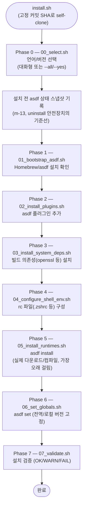
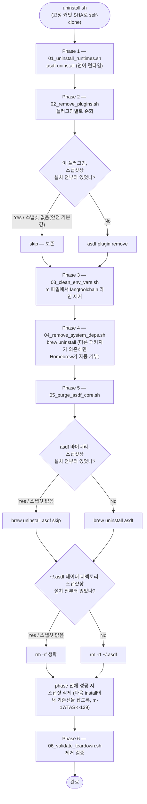

# 아키텍처 개요

이 문서는 langtoolchain의 install/uninstall 흐름을 다이어그램으로 정리한 것입니다.
용어는 무겁게 안 갑니다 — "아키텍처 택틱"류의 학술적 분류 체계(SEI/Bass·Clements·
Kazman 계열) 대신, 애자일 진영에서 실제로 쓰이는 가벼운 관행을 따릅니다:

- **다이어그램**: [C4 모델](https://c4model.com/)이 표준으로 삼는 "abstraction-first,
  필요한 만큼만" 원칙 — UML/SysML 같은 무거운 표기법 대신 GitHub가 네이티브로 렌더링하는
  Mermaid로 흐름만 명확히 보여줍니다.
- **문서화 정도**: [arc42](https://arc42.org/)의 "travel light" 모토 — 프로젝트 규모에
  안 맞는 항목(수십 개 섹션짜리 템플릿)은 채우지 않고, 실제로 헷갈리는 부분(phase 순서,
  안전장치가 언제 개입하는지)만 다룹니다.
- **설계 결정 기록**: 이 저장소는 이미 [ADR(Architecture Decision Record)](https://docs.arc42.org/section-9/)
  패턴을 쓰고 있습니다 — `backlog decision`(`backlog/decisions/decision-*.md`)이 그
  역할입니다. 왜 uv를 poetry 대신 골랐는지(decision-5), 왜 asdf 플러그인 커밋을 안
  고정하기로 했는지(decision-2) 같은 결정들이 전부 여기 기록돼 있습니다 — 별도
  `docs/adr/` 폴더를 새로 만들 필요가 없습니다.

## install.sh 흐름

`install.sh`가 저장소를 고정 커밋으로 self-clone한 뒤, `scripts/install/main.sh`가
아래 phase를 순서대로 실행합니다. `--dry-run`이면 모든 변경 단계가 실제로 실행되지
않고 로그만 찍힙니다.

## uninstall.sh 흐름 — prior-state 안전장치가 개입하는 지점

`uninstall.sh`도 동일하게 self-clone 후 phase를 순서대로 실행합니다. 핵심은 phase 2와
5에서 **install 시점에 기록한 스냅샷을 확인해서, langtoolchain이 설치하지 않은 것은
건드리지 않는다**는 점입니다(m-13 + m-16/TASK-130 + m-17/TASK-144).

실제로 이 두 게이트(G2, G5a, G5b)는 전부 같은 스냅샷 파일
(`$HOME/.langtoolchain-prior-asdf-state`, `lt_snapshot_prior_asdf_state()`/
`lt_prior_state_get()`, `scripts/lib.sh`)을 참조합니다 — 스냅샷이 아예 없으면(예:
이 기능이 생기기 전에 설치한 경우) "안전 기본값"으로 항상 보존 쪽을 택합니다.
