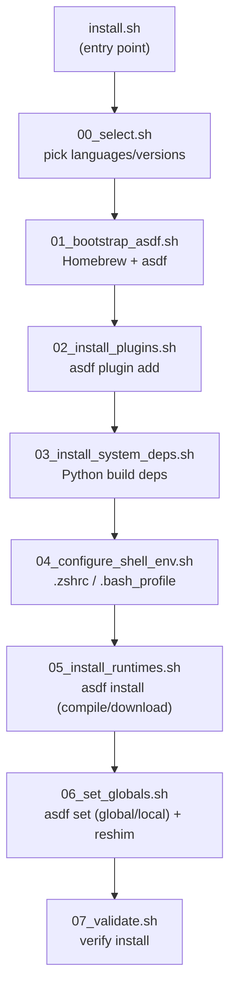

<div align="center">

# 🧰 langtoolchain

**Install Node.js · Java · Python · Rust · Go compilers on macOS with one command**

[](https://opensource.org/licenses/MIT)
[](#-prerequisites)
[](#-design-principles)
[](https://asdf-vm.com)

[한국어](readme.md) | **English**

No `git clone`, no manual setup. Paste one line into your terminal and you're done.

</div>

<br>

```zsh
curl -fsSL https://raw.githubusercontent.com/amosQP/langtoolchain/main/install.sh | sh
```

<br>

## Why this exists

Every new Mac meant reinstalling Homebrew and asdf, adding plugins, and fixing `.zshrc` by hand — the same grind every time. I got tired of it, so I built this. **Now it's one line.** Homebrew, asdf, language selection, shell config — all automatic.

- 🍺 **Works without Homebrew** — installs it via the official script if missing (you only type your sudo password)
- ☑️ **Checkbox-style interactive install** — confirm install/skip and version per language
- 🌐 **Full `curl | sh` support** — clones the remote repo into a scratch dir on its own if nothing's local
- 🌍 **Global or per-directory version pinning** — set a system-wide default, or scope it to one project
- 🧩 **Independent, modular structure** — no phase depends on another, so you can read/fix just the part you need
- 🔙 **Clean uninstall** — everything it installed can be undone (backups kept as `.bak`)
- 🔁 **Retries + partial-failure isolation** — a transient network blip retries automatically, and one language failing doesn't stop the rest from being attempted
- 🖥️ **POSIX sh compatible** — runs as-is under macOS's default shell (`/bin/sh`), no bash-only syntax

<br>

## 📦 Scope

langtoolchain installs and manages exactly **5 languages (Node.js, Java, Python, Rust, Go)** (+ each
language's companion tool, pnpm and gradle) and the 6 Homebrew packages they need to build (`asdf`,
`openssl`, etc.) — nothing else. **On the install side**, it never touches other packages already on
your Mac or installed later via `brew install`, or asdf plugins this tool didn't install itself.

| | Managed by langtoolchain | Not managed |
|---|---|---|
| 🍺 Homebrew | `asdf` + 6 system packages for compiling | every other `brew` package |
| 🧬 asdf | `nodejs`/`java`/`python`/`rust`/`golang` + companion plugins `pnpm`(nodejs)/`gradle`(java) | plugins for other languages/tools (uninstall is an exception — see below) |
| 🗂️ Version pinning | the languages you pick (+ companions), at the scope you pick (global/directory) | everything else |

> ⚠️ **uninstall is an exception**: since it purges asdf entirely, any other asdf plugins you have
> — even ones langtoolchain never installed — get removed along with the rest of `~/.asdf/`. See
> "What Gets Removed" below. The install side's "not managed" column and uninstall's actual behavior
> differ — keep that in mind.

**Why pnpm/gradle are companions**: the nodejs/java asdf plugins install only a bare Node runtime /
JDK, with no separate package or build manager — real projects almost always need pnpm (node) or
gradle (java) on top. Rust and Go don't get one: asdf-rust already bundles cargo, and `go` itself
already has modules/build tooling built in — so there's nothing missing to fill in for those two.

<br>

## Table of Contents

- [Quick Reference (commands you'll actually use)](#-quick-reference-commands-youll-actually-use)
- [Quick Start](#-quick-start)
- [Scope](#-scope)
- [Prerequisites](#-prerequisites)
- [What Gets Installed](#-what-gets-installed)
- [How It Works](#%EF%B8%8F-how-it-works)
- [Version Pin Scope: Global vs. Per-Directory](#-version-pin-scope-global-vs-per-directory)
- [Filesystem Layout](#-filesystem-layout-what-ends-up-where)
- [Verifying / Uninstalling](#-verifying-the-install)
- [Code Structure](#-code-structure-file-by-file)
- [Design Principles](#-design-principles)
- [Contributing](#-contributing)
- [Known Limitations / Future Work](#-known-limitations--future-work)
- [License](#-license)

<br>

## 📎 Quick Reference (commands you'll actually use)

Every flag and usage pattern that exists, in one place, for when you forget.

### Install

Add `-s -- <flags>` after `curl -fsSL <url> | sh`. Flags combine freely.

```zsh
# Interactive (asks per language for install/skip, version, pin scope) — just run it with no flags
curl -fsSL https://raw.githubusercontent.com/amosQP/langtoolchain/main/install.sh | sh

# --all: skip the language picker, install everything in .tool-versions (still asks version/scope)
curl -fsSL https://raw.githubusercontent.com/amosQP/langtoolchain/main/install.sh | sh -s -- --all

# --yes: skip only the final "install these?" confirmation (language picker still interactive)
curl -fsSL https://raw.githubusercontent.com/amosQP/langtoolchain/main/install.sh | sh -s -- --yes

# --all --yes: no questions at all, everything automatic (the usual combo for scripts/CI)
curl -fsSL https://raw.githubusercontent.com/amosQP/langtoolchain/main/install.sh | sh -s -- --all --yes

# --dry-run: only print what would happen, change nothing (combines freely with the others)
curl -fsSL https://raw.githubusercontent.com/amosQP/langtoolchain/main/install.sh | sh -s -- --dry-run --all --yes

# --local: pin versions to the CURRENT directory instead of globally (skips the scope prompt too)
curl -fsSL https://raw.githubusercontent.com/amosQP/langtoolchain/main/install.sh | sh -s -- --local

# --local=<dir>: pin to a specific directory
curl -fsSL https://raw.githubusercontent.com/amosQP/langtoolchain/main/install.sh | sh -s -- --local=/path/to/project

# Already have a local clone? Skip curl | sh and just run it directly (same flags as above)
git clone https://github.com/amosQP/langtoolchain.git && cd langtoolchain
./install.sh                    # or ./install.sh --all --yes, etc.
```

> With no controlling terminal (CI, etc.), running with no flags automatically behaves like `--all`.

### Verify the install

```zsh
source ~/.zshrc                                     # or open a new terminal tab
node -v && java -version && python --version && rustc --version && go version
pnpm --version && gradle --version                   # if you installed the companions too
which node java python rustc go pnpm gradle           # should point under ~/.asdf/shims/...
asdf current                                          # every currently active version
asdf current nodejs                                   # just one language
asdf list nodejs                                      # versions installed on this machine
asdf list all nodejs                                  # every installable version (no install needed to check)
```

### Uninstall

```zsh
# Interactive confirmation, then uninstall
curl -fsSL https://raw.githubusercontent.com/amosQP/langtoolchain/main/uninstall.sh | sh

# No confirmation prompt
curl -fsSL https://raw.githubusercontent.com/amosQP/langtoolchain/main/uninstall.sh | sh -s -- --yes

# Preview the uninstall (removes nothing)
curl -fsSL https://raw.githubusercontent.com/amosQP/langtoolchain/main/uninstall.sh | sh -s -- --dry-run --yes

# From a local clone
./uninstall.sh                  # or ./uninstall.sh --yes / --dry-run --yes
```

Open a new shell session with `exec $SHELL` afterward so cached state like PATH is fully gone.

### Running a single phase (debugging / advanced)

Every phase runs standalone. `DRY_RUN=true` previews it; `TOOL_VERSIONS_FILE=<path>` points it at a
config file other than this repo's own default.

```zsh
DRY_RUN=true sh scripts/install/05_install_runtimes.sh      # e.g. preview just the runtime-install phase
TOOL_VERSIONS_FILE=/path/to/custom sh scripts/install/06_set_globals.sh
```

| install phases | uninstall phases |
|---|---|
| `00_select.sh` [details](#-code-structure-file-by-file) | `01_uninstall_runtimes.sh` |
| `01_bootstrap_asdf.sh` | `02_remove_plugins.sh` |
| `02_install_plugins.sh` | `03_clean_env_vars.sh` |
| `03_install_system_deps.sh` | `04_remove_system_deps.sh` |
| `04_configure_shell_env.sh` | `05_purge_asdf_core.sh` |
| `05_install_runtimes.sh` | `06_validate_teardown.sh` |
| `06_set_globals.sh` | |
| `07_validate.sh` | |

See [Code Structure](#-code-structure-file-by-file) for exactly what each file does.

### Troubleshooting

| Situation | What to do |
|---|---|
| Install/uninstall got interrupted (network, Ctrl-C) | Just run the same command again — anything already done is skipped automatically |
| Want to change which languages/versions get installed | Edit one line in `.tool-versions`, then reinstall (or just pick differently in the interactive prompt) |
| Want to see what's currently pinned globally/locally | `asdf current` |
| "Another langtoolchain install/uninstall appears to be running" | If nothing is really running concurrently, remove the lock directory the error message names and retry |
| "Not enough disk space" | Free up at least 5GB on the volume containing `$HOME`, then retry |
| Only one language failed to install | The others most likely already succeeded — re-run the same install command and only the failed one gets retried |
| Want to change a `--local` pin by hand later | Run `asdf set <plugin> <version>` directly in that directory ([details](#-version-pin-scope-global-vs-per-directory)) |

<br>

## 🚀 Quick Start

```zsh
curl -fsSL https://raw.githubusercontent.com/amosQP/langtoolchain/main/install.sh | sh
```

If you already have it cloned locally:

```zsh
git clone https://github.com/amosQP/langtoolchain.git && cd langtoolchain
./install.sh
```

Confirms install/skip and version per language (Enter = yes), then asks once more before starting.

```text
== Choose which languages to install (Enter = yes) ==

Install nodejs (node)? [Y/n] > ⏎
  Version [default: lts] > ⏎
  Also install pnpm (companion to nodejs)? [Y/n] > ⏎
    Version [default: 10.33.0] > ⏎

Install java (java)? [Y/n] > n

Install python (python)? [Y/n] > ⏎
  Version [default: 3.12.13] > ⏎
...
== Install list ==
  nodejs  lts
  pnpm    10.33.0
  python  3.12.13
  rust    1.94.0
  golang  1.26.1

Pin globally, or only to this directory? [global/local, default: global] > ⏎

Install these? [Y/n] > ⏎
```

> The last prompt decides **where** the versions you just picked get activated — see
> [Version Pin Scope](#-version-pin-scope-global-vs-per-directory) right below for details.
>
> A companion tool (pnpm/gradle) is only offered right after you accept its parent language
> (nodejs/java) — in the example above, declining java with `n` means the gradle question never
> shows up at all.

<details>
<summary><b>Flags</b> (pass them as <code>curl | sh -s -- &lt;flags&gt;</code>)</summary>
<br>

| Flag | Applies to | Behavior |
|---|---|---|
| `--all` | install | Skip the language picker, install everything in `.tool-versions` |
| `--yes` | install / uninstall | Skip the final confirmation prompt |
| `--dry-run` | install / uninstall | Change nothing — just print what would happen |
| `--local` / `--local=<dir>` | install | Pin versions to the current (or given) directory instead of globally. [Details](#-version-pin-scope-global-vs-per-directory) |

> With no controlling terminal (CI, etc.), it automatically behaves like `--all` — it never hangs waiting for input.

</details>

<br>

## 📋 Prerequisites

| Needed | If missing |
|---|---|
| macOS | This tool is macOS-only |
| `git` (for the remote installer) | Ships with the Xcode Command Line Tools |
| ~~Homebrew~~ | The installer installs it for you (you'll still be prompted for your sudo password) |
| ~~asdf~~ | The installer installs it via `brew install asdf` |

<br>

## 📦 What Gets Installed

The default languages/versions from `.tool-versions` — toggle each one on/off or override its version
on the install screen. Companion tools (pnpm/gradle) are optional and only offered when you install
their parent language.

| Language / companion | Default version |
|---|---|
| 🟩 Node.js | `lts` |
| &nbsp;&nbsp;└ pnpm (companion) | `10.33.0` |
| ☕ Java (Temurin) | `temurin-25.0.2+10.0.LTS` |
| &nbsp;&nbsp;└ gradle (companion) | `9.4.1` |
| 🐍 Python | `3.12.13` |
| 🦀 Rust | `1.94.0` |
| 🐹 Go | `1.26.1` |

The Homebrew packages Python needs to compile (`openssl`, `readline`, `sqlite3`, `xz`, `zlib`, `tcl-tk`) are installed alongside it.

<br>

## ⚙️ How It Works



1. **Entry point (`install.sh`)** — runs directly from a local clone; via `curl | sh`, clones into a scratch dir (`git clone --depth 1`) and cleans it up with `trap` afterward.
2. **Language selection (`00_select.sh`)** — asks install/skip and version per language, plus global/local pin scope. Reads/writes `/dev/tty` directly so it works under `curl | sh`. Writes a temp `.tool-versions` file, returns just its path on stdout. No terminal → installs everything automatically.
3. **Homebrew/asdf bootstrap (`01_bootstrap_asdf.sh`)** — installs Homebrew via the official script if missing (sudo password needed), `asdf` via `brew install asdf` if missing.
4. **Plugin install (`02_install_plugins.sh`)** — `asdf plugin add` for each selected language.
5. **System dependencies (`03_install_system_deps.sh`)** — installs the Homebrew packages Python needs to compile.
6. **Shell environment (`04_configure_shell_env.sh`)** — adds asdf shim PATH, Java home, and compiler flags to the right rc file, idempotently.
7. **Runtime install (`05_install_runtimes.sh`)** — `asdf install <plugin> <version>` — the slow compile/download step.
8. **Version pinning (`06_set_globals.sh`)** — `asdf set -u` (global) or `asdf set` (local) per the chosen scope, then `asdf reshim`.
9. **Validation (`07_validate.sh`)** — checks each binary resolves through an asdf shim and the version is correct.

> **Core design principle**: each step runs as its own `sh` process, so none of them rely on another step's `export`. Step 5 doesn't trust that step 4 already wrote PATH — it calls `ensure_asdf_on_path` itself. That's why any single step can run standalone (`sh scripts/install/05_install_runtimes.sh`) and still work.

<br>

## 🌍 Version Pin Scope: Global vs. Per-Directory

asdf installs a language runtime **exactly once** (`~/.asdf/installs/<plugin>/<version>/`), and a
`.tool-versions` file only decides "which of the installed versions to actually use right now." That
decision has two possible scopes.

| Scope | Stored in | Command run | Applies to |
|---|---|---|---|
| **Global** | `~/.tool-versions` | `asdf set -u <plugin> <version>` | The default for every directory that doesn't say otherwise |
| **Per-directory (Local)** | `<given directory>/.tool-versions` | `asdf set <plugin> <version>` (no `-u`) | Only that directory (and its subdirectories), overriding the global value |

Example: you normally use the latest Node.js, but one legacy project needs Node 18 — pin it locally to
just that project's directory, and nothing else on the machine is affected.

> 💡 **The analogy**: nvm's `.nvmrc`, pyenv's `.python-version` — those "this folder uses this version"
> files. asdf just unifies all of that into one `.tool-versions` format regardless of language. Global
> is simply the fallback for when that file doesn't exist.

### Usage

**Interactive**: asked right before the final install confirmation (Enter = global).
```text
Pin globally, or only to this directory? [global/local, default: global] > local
  Which directory should this pin to? [default: current directory] > ⏎
```

**Flags** (non-interactive, skips the prompt):
```zsh
./install.sh --local                    # pin to the current directory
./install.sh --local=/path/to/project    # pin to the given directory
./install.sh                             # (default) pin globally
```

### How it's implemented

`00_select.sh` asks for the pin scope alongside language selection, then **records it as a comment on
the first line** of the selection result file:

```
# scope: global
nodejs lts
python 3.12.13
```
or
```
# scope: local /Users/me/myproject
nodejs lts
```

Lines starting with `#` are ignored by parsing, so the language/version logic never had to change.
`06_set_globals.sh` reads this line via `read_scope()` and branches on it; if it's absent, it always
behaves as global.

### If you want to manage an already-local pin by hand later

langtoolchain is just running standard asdf commands for you — open that directory's `.tool-versions`
directly, or run `asdf current`/`asdf set <plugin> <version>` yourself. No separate command to learn.

<br>

## 🗂️ Filesystem Layout: What Ends Up Where

### Where each language actually gets installed

Everything is managed by asdf, following these two path rules.

| Language | Plugin name | Install dir (`asdf install`) | Shim (what PATH actually points to) |
|---|---|---|---|
| 🟩 Node.js | `nodejs` | `~/.asdf/installs/nodejs/<version>/` | `~/.asdf/shims/node`, `npm`, `npx`, etc. |
| &nbsp;&nbsp;└ pnpm (companion) | `pnpm` | `~/.asdf/installs/pnpm/<version>/` | `~/.asdf/shims/pnpm` |
| ☕ Java | `java` | `~/.asdf/installs/java/<version>/` | `~/.asdf/shims/java`, `javac`, etc. |
| &nbsp;&nbsp;└ gradle (companion) | `gradle` | `~/.asdf/installs/gradle/<version>/` | `~/.asdf/shims/gradle` |
| 🐍 Python | `python` | `~/.asdf/installs/python/<version>/` | `~/.asdf/shims/python`, `pip`, etc. |
| 🦀 Rust | `rust` | `~/.asdf/installs/rust/<version>/` | `~/.asdf/shims/rustc`, `cargo`, etc. |
| 🐹 Go | `golang` | `~/.asdf/installs/golang/<version>/` | `~/.asdf/shims/go`, `gofmt`, etc. |

> `<version>` is exactly the string written in `.tool-versions` — for example, `nodejs` literally gets a directory named `lts`, i.e. `~/.asdf/installs/nodejs/lts/`. Each language plugin's own source lives separately, under `~/.asdf/plugins/<plugin>/`.

### Shared asdf state (`$ASDF_DATA_DIR`, defaults to `~/.asdf/`)

| Path | Contents |
|---|---|
| `~/.asdf/plugins/` | Each language plugin's git checkout |
| `~/.asdf/installs/` | The actual compiled runtimes (table above) |
| `~/.asdf/downloads/` | Source/binary cache downloaded during install |
| `~/.asdf/shims/` | The thin wrapper executables PATH actually points to |
| `~/.asdf/langtoolchain-local-pins` | List of directories pinned with `--local` — lets uninstall find and remove local-only versions too |

### Where configuration gets stored

| File | What goes in it | Which script writes it |
|---|---|---|
| `~/.tool-versions` (global — a different file from this repo's own `.tool-versions`) | The global default version per language | `06_set_globals.sh`'s `asdf set -u` (default, i.e. run without `--local`) |
| `<given directory>/.tool-versions` (only with `--local`) | The version that applies only inside that directory | `06_set_globals.sh`'s `asdf set` — see [Version Pin Scope](#-version-pin-scope-global-vs-per-directory) |
| `~/.zshrc` or `~/.bash_profile` (auto-picked from your login shell) | `eval "$(brew shellenv)"` (prepended at the top of the file), `ASDF_DATA_DIR`/PATH shim export, Java home hook, `LDFLAGS`/`CPPFLAGS`/`PKG_CONFIG_PATH` | `04_configure_shell_env.sh` |
| This repo's own `.tool-versions` | **Read-only** — the source of the default language/version list. The installer never writes to it | Every phase script only reads it |

### What gets installed via Homebrew (under `/opt/homebrew/`, on Apple Silicon)

`asdf` · `openssl` · `readline` · `sqlite3` · `xz` · `zlib` · `tcl-tk`

### What's only ever temporary

- **Language selection result file**: created under the system temp directory (`$TMPDIR`) via `mktemp -t langtoolchain-selection`, deleted by `main.sh` once install finishes
- **The repo clone made for `curl | sh`**: cloned into a scratch directory via `mktemp -d`, auto-deleted via `trap` when the script exits
- **Concurrency lock**: `$TMPDIR/langtoolchain.lock` — created when install/uninstall starts, deleted via `trap` when it ends. Shared between install and uninstall, so they can't run concurrently with each other either

### What gets removed on uninstall (`uninstall.sh`)

All of `~/.asdf/` (everything in the table above) · the Homebrew-installed `asdf`/`openssl`/`readline`/`sqlite3`/`xz`/`zlib`/`tcl-tk` · `~/.tool-versions` (global) · the lines this tool added to `~/.zshrc`/`~/.bash_profile`/`~/.bashrc` (removed via `sed -i '.bak'`, keeping a backup at `<file>.bak`).

> ⚠️ **This repo's own `.tool-versions` is never touched.**

<br>

## ✅ Verifying the Install

```zsh
source ~/.zshrc   # or open a new terminal tab
node -v && java -version && python --version && rustc --version && go version
which node java python rustc go   # should point under ~/.asdf/shims/...
```

<br>

## 🗑️ Uninstalling

```zsh
curl -fsSL https://raw.githubusercontent.com/amosQP/langtoolchain/main/uninstall.sh | sh
```

Asks for confirmation once before running (skip with `--yes`); `--dry-run` is supported the same way.
After uninstalling, open a new shell session with `exec $SHELL` so cached state like PATH is fully gone.

<br>

## 📁 Code Structure (file by file)

```
langtoolchain/
├── install.sh              ⇐ curl entry point
├── uninstall.sh             ⇐ curl entry point (uninstall)
├── .tool-versions            default language/version list (read-only source)
├── LICENSE                   MIT
└── scripts/
    ├── lib.sh                shared utility module
    ├── install/               install steps (one responsibility per file)
    │   ├── 00_select.sh
    │   ├── 01_bootstrap_asdf.sh
    │   ├── 02_install_plugins.sh
    │   ├── 03_install_system_deps.sh
    │   ├── 04_configure_shell_env.sh
    │   ├── 05_install_runtimes.sh
    │   ├── 06_set_globals.sh
    │   ├── 07_validate.sh
    │   └── main.sh
    └── uninstall/             uninstall steps (same pattern)
        ├── 01_uninstall_runtimes.sh
        ├── 02_remove_plugins.sh
        ├── 03_clean_env_vars.sh
        ├── 04_remove_system_deps.sh
        ├── 05_purge_asdf_core.sh
        ├── 06_validate_teardown.sh
        └── main.sh
```

### Root

| File | Role |
|---|---|
| `install.sh` | curl entry point. Runs `scripts/install/main.sh` directly if this is a local clone, otherwise `git clone`s into a scratch directory and runs it from there |
| `uninstall.sh` | The uninstall entry point, same pattern (calls `scripts/uninstall/main.sh`) |
| `.tool-versions` | The default language/version list to install. Uses asdf's standard format (`plugin version`) as-is — to add or change a language, edit this one file |

> `install.sh`/`uninstall.sh` are deliberately separate entry points — they're not bundled into one.
> Each needs to be independently `curl | sh`-able (one script shouldn't hide a different command
> behind it), and fetching only what you actually need is clearer.

### `scripts/lib.sh`

Pure functions shared by every phase script. Phase scripts don't depend on each other except by sourcing this one file.

| Function | Role |
|---|---|
| `log`, `step`, `die` | Print a log line, print a section header, print an error and exit immediately |
| `run` | Under `--dry-run`, only prints the command; otherwise runs it for real |
| `repo_root_from` | Derives the repo root from a script's own path |
| `each_tool` | Parses a `.tool-versions`-style file into `plugin version` pairs |
| `detect_rc_file` | Decides whether to edit `.zshrc` or `.bash_profile` based on `$SHELL` |
| `append_env_var` | Idempotently (no duplicates) appends a line to the **end** of an rc file |
| `prepend_env_var` | Idempotently prepends a line to the **top** of an rc file — used for lines where PATH priority matters (`brew shellenv`) |
| `read_scope` | Reads the selection file's `# scope: ...` line and returns "global" or "local:\<dir\>" (or "global" if the line is absent) |
| `ensure_asdf_on_path` | Ensures asdf/its shims are on PATH for this process |
| `ensure_brew_on_path` | Ensures `brew` is on PATH for this process (auto-detects the Apple Silicon/Intel install path) |
| `ensure_build_flags` | Exports the `LDFLAGS`/`CPPFLAGS`/`PKG_CONFIG_PATH` Python (and friends) need to compile, into this process |
| `binary_for_plugin`, `flag_for_binary` | Maps a plugin name ↔ its actual binary name ↔ its version-check flag (implemented as `case`, since POSIX sh has no associative arrays) |
| `version_core` | Extracts just the `X.Y[.Z]` numeric part of a version string (e.g. `temurin-25.0.2+10.0.LTS` → `25.0.2`); fails on a non-numeric alias like `lts` |
| `lt_homebrew_prefix` | Returns the Homebrew install prefix for the current CPU architecture (`/opt/homebrew` or `/usr/local`) |
| `lt_env_var_defs` | Defines the search pattern, placement, and content of every rc-file line this tool manages, in one place — install and uninstall both read from this single definition so they can't drift apart |

### `scripts/install/`

| File | Role |
|---|---|
| `00_select.sh` | Interactive picker for install/skip and version per language, plus the pin scope (global/local). Reads and writes `/dev/tty` directly so it works under `curl \| sh` too. Returns a temporary `.tool-versions`-style file (with a `# scope: ...` first line) |
| `01_bootstrap_asdf.sh` | Installs Homebrew via the official script if missing (needs sudo), installs `asdf` via `brew install asdf` if missing |
| `02_install_plugins.sh` | `asdf plugin add` for each selected language |
| `03_install_system_deps.sh` | Installs the Homebrew packages Python needs to compile |
| `04_configure_shell_env.sh` | Writes the asdf/build environment variables into the rc file |
| `05_install_runtimes.sh` | `asdf install` — the actual compile/download step |
| `06_set_globals.sh` | Runs `asdf set -u` (global) or `asdf set` (local), per the selection file's `# scope:` line, then `asdf reshim` |
| `07_validate.sh` | Verifies the install (binary paths, version output) |
| `main.sh` | The orchestrator that runs the scripts above in order. Handles `--dry-run`/`--all`/`--yes`/`--local[=DIR]`, forwarding what's needed to `00_select.sh` |

### `scripts/uninstall/`

The reverse of install, following the same independent-execution principle.

| File | Role |
|---|---|
| `01_uninstall_runtimes.sh` | Removes installed runtimes via `asdf uninstall` |
| `02_remove_plugins.sh` | Removes every installed asdf plugin |
| `03_clean_env_vars.sh` | Removes the lines this tool added from rc files (keeps a `.bak` backup) |
| `04_remove_system_deps.sh` | Removes the Homebrew system packages |
| `05_purge_asdf_core.sh` | Removes `asdf` itself, `~/.asdf/`, and the global `~/.tool-versions` |
| `06_validate_teardown.sh` | Verifies the uninstall |
| `main.sh` | Runs the above in order, with a confirmation prompt before it starts |

<br>

## 🧠 Design Principles

Worth knowing before you contribute.

<details>
<summary><b>1. Each phase is independent — none of them rely on `export`</b></summary>
<br>

Each phase runs as its own `sh` process, so an `export` in one phase never carries over to the next. Any script that needs `asdf` or build flags calls `ensure_asdf_on_path`/`ensure_build_flags` itself. That's why any phase can run standalone (`sh scripts/install/05_install_runtimes.sh`) and still work, and why reordering or adding/removing phases is easy.
</details>

<details>
<summary><b>2. Loops reading .tool-versions use fd 3, not stdin</b></summary>
<br>

Loops parsing `.tool-versions` use fd 3 instead of stdin, since the loop body runs an external command like `asdf` that could otherwise steal input meant for the loop. POSIX sh has no process substitution, so it's a two-step dance: `each_tool ... > "$TMP"` writes a temp file first, then `done 3< "$TMP"` binds it to fd 3.
</details>

<details>
<summary><b>3. Never pipe straight into grep -q (SIGPIPE)</b></summary>
<br>

`cmd | grep -q ...` is dangerous: `grep -q` closes the pipe the instant it matches, and if the upstream command is still writing, it dies from SIGPIPE. This is independent of `pipefail` (bash-only, not in POSIX sh anyway) — capture the output into a variable first, then grep the variable.
</details>

<details>
<summary><b>4. Stays POSIX sh compatible</b></summary>
<br>

Formatting (indentation, line length, naming) follows the [Google Shell Style Guide](https://google.github.io/styleguide/shellguide.html), but the compatibility layer is POSIX sh — it runs under `curl | sh` no matter which `sh` is on PATH. Avoided:

- `[[ ... ]]` — uses `[ ... ]`, and `case` for glob matching
- Arrays (`declare -A`, `arr=()`) — uses a newline-delimited string plus `IFS`/`set --` instead
- Process substitution `<(cmd)` — uses a `mktemp` temp file instead
- `[[ =~ ]]`/`BASH_REMATCH` — uses `sed`'s BRE instead
- `set -o pipefail` — a bash/ksh/zsh-only option not in POSIX
- `&>` — uses `>file 2>&1` instead
- `${BASH_SOURCE[0]}` — uses `$0` instead

One trap: a POSIX **special built-in** (like `:`, the no-op) kills a non-interactive shell on a redirection failure regardless of `set -e`/`||` — dash enforces this as specified, bash's default mode is more lenient. For a "redirection that might fail, with a `||` fallback" pattern — like probing `/dev/tty` — use `true` instead of `:`.
</details>

<details>
<summary><b>5. Order determines PATH priority when adding lines to an rc file</b></summary>
<br>

Since each `export PATH="X:$PATH"` prepends X ahead of whatever's already there, **the line sourced later wins PATH priority.** A line that must be sourced first — like `brew shellenv` — goes in via `prepend_env_var` (top of file), not `append_env_var` (bottom), so the asdf shim PATH line after it always ends up prepended last.
</details>

<details>
<summary><b>6. Scripts with a cleanup EXIT trap never use exec</b></summary>
<br>

`exec cmd` replaces the current process outright, skipping any registered `trap ... EXIT`. `install.sh`/`uninstall.sh` register `trap 'rm -rf "$WORKDIR"' EXIT` to clean up a scratch clone, so they invoke the real script afterward as a plain call + `exit $?`, not `exec`. (The local-clone path, with nothing to clean up, uses `exec` as normal.)
</details>

<details>
<summary><b>7. sed scripts are written for macOS's default sed (BSD sed)</b></summary>
<br>

macOS's `/usr/bin/sed` is BSD sed, whose regex dialect differs from GNU sed's. Alternation like `\(a\|b\)` is a GNU extension — under BSD sed's default mode it **silently matches nothing**. If you need alternation, turn on `-E` and use plain `(`/`)`/`|`.
</details>

<br>

## 🤝 Contributing

- To change languages/versions, edit `.tool-versions` — just one line.
- To fix or debug a single phase, run it standalone: `DRY_RUN=true sh scripts/install/05_install_runtimes.sh`
- After changing code: `shellcheck -s sh` → `dash -n` (macOS's default `/bin/sh` is bash in posix mode, lenient enough to miss real POSIX violations) → `shellspec`/`shellspec --shell dash` for the `spec/` suite.
- To confirm the whole flow changes nothing: `./install.sh --dry-run --all --yes`, `./uninstall.sh --dry-run --yes`
- Real-hardware scenarios (Homebrew bootstrap, Intel Mac, etc.) run via `.github/workflows/e2e-verify.yml`, triggered with `workflow_dispatch`, on GitHub-hosted macOS runners (arm64 + Intel) — free on this public repo.

<br>

## 🧭 Known Limitations / Future Work

- **macOS only** — no Linux/Windows support.
- **Fixed to 5 languages** — adding another language means editing code; there's no way to freely add arbitrary asdf plugins the way raw asdf allows.
- **CI is manually triggered only** — `e2e-verify.yml` only supports `workflow_dispatch`, not automatic runs on every PR/push.
- **Some features go beyond the core mission ("install compilers")** — global/local version pinning and the interactive picker are really a wrapper around asdf's own version management. Whether to trim them is still undecided.
- **No support for tooling outside Homebrew/asdf** — MacPorts (`/opt/local`) doesn't overlap paths, so no file conflicts, but a same-named binary it installs still wins if its rc entry loads later (same issue as design principle 5). `mise`, which reads `.tool-versions` directly and activates via its own PATH hook, is the more realistic risk — if it loads after langtoolchain in the rc file, it can silently shadow the asdf shim. Neither case is detected or warned about.

<br>

## 📝 License

<div align="center">

[MIT](https://opensource.org/licenses/MIT) — free for anyone to use and modify. (This repo's [LICENSE](LICENSE) file has the same text.)

Made with 🧉 by [amosQP](https://github.com/amosQP)

</div>
