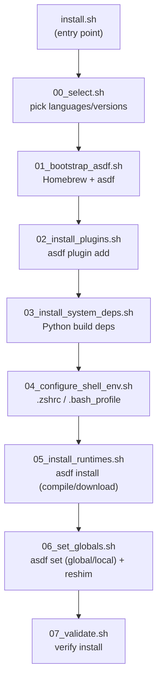

<div align="center">

# 🧰 langtoolchain

**Install Node.js · Java · Python · Rust · Go compilers on macOS with one command**

[](https://opensource.org/licenses/MIT)
[](#-prerequisites)
[](#-design-principles)
[](https://asdf-vm.com)

[한국어](readme.md) | **English**

No `git clone`, no manual setup. Paste one line into your terminal and you're done.

</div>

<br>

```zsh
curl -fsSL https://raw.githubusercontent.com/amosQP/langtoolchain/main/install.sh | sh
```

<br>

## Why this exists

Every time I got a new Mac, I'd install Homebrew, install asdf, add plugins for each language, fix compiler flags in `.zshrc`... the same grind, every single time. I got tired of it, so I built this. **Now it's one line.** If Homebrew isn't there, it installs itself. If asdf isn't there, same thing. You check off the languages you want like a checklist, and the shell config gets wired up automatically.

- 🍺 **Works without Homebrew** — installs it via the official script if missing (you only type your sudo password)
- ☑️ **Checkbox-style interactive install** — confirm install/skip and version per language
- 🌐 **Full `curl | sh` support** — clones the remote repo into a scratch dir on its own if nothing's local
- 🌍 **Global or per-directory version pinning** — set a system-wide default, or scope it to one project
- 🧩 **Independent, modular structure** — no phase depends on another, so you can read/fix just the part you need
- 🔙 **Clean uninstall** — everything it installed can be undone (backups kept as `.bak`)
- 🖥️ **POSIX sh compatible** — runs as-is under macOS's default shell (`/bin/sh`), no bash-only syntax

<br>

## 📦 Scope

langtoolchain installs and manages exactly **5 languages (Node.js, Java, Python, Rust, Go)** and the
6 Homebrew packages they need to build (`asdf`, `openssl`, etc.) — nothing else. It never touches
other packages already on your Mac or installed later via `brew install`, asdf plugins for other
languages, or other version managers.

| | Managed by langtoolchain | Not managed |
|---|---|---|
| 🍺 Homebrew | `asdf` + 6 system packages for compiling | every other `brew` package |
| 🧬 asdf | `nodejs`/`java`/`python`/`rust`/`golang` plugins | plugins for other languages/tools |
| 🗂️ Version pinning | the languages you pick, at the scope you pick (global/directory) | everything else |

<br>

## Table of Contents

- [Quick Start](#-quick-start)
- [Scope](#-scope)
- [Prerequisites](#-prerequisites)
- [What Gets Installed](#-what-gets-installed)
- [How It Works](#%EF%B8%8F-how-it-works)
- [Version Pin Scope: Global vs. Per-Directory](#-version-pin-scope-global-vs-per-directory)
- [Filesystem Layout](#-filesystem-layout-what-ends-up-where)
- [Verifying / Uninstalling](#-verifying-the-install)
- [Code Structure](#-code-structure-file-by-file)
- [Design Principles](#-design-principles)
- [Contributing](#-contributing)
- [License](#-license)

<br>

## 🚀 Quick Start

```zsh
curl -fsSL https://raw.githubusercontent.com/amosQP/langtoolchain/main/install.sh | sh
```

If you already have it cloned locally:

```zsh
git clone https://github.com/amosQP/langtoolchain.git && cd langtoolchain
./install.sh
```

Running it asks, per language, whether to install it (Enter = yes) and lets you confirm/override the
version, then asks once more ("Install these?") before actually starting.

```text
== Choose which languages to install (Enter = yes) ==

Install nodejs (node)? [Y/n] > ⏎
  Version [default: lts] > ⏎

Install java (java)? [Y/n] > n

Install python (python)? [Y/n] > ⏎
  Version [default: 3.12.13] > ⏎
...
== Install list ==
  nodejs  lts
  python  3.12.13
  rust    1.94.0
  golang  1.26.1

Pin globally, or only to this directory? [global/local, default: global] > ⏎

Install these? [Y/n] > ⏎
```

> The last prompt decides **where** the versions you just picked get activated — see
> [Version Pin Scope](#-version-pin-scope-global-vs-per-directory) right below for details.

<details>
<summary><b>Flags</b> (pass them as <code>curl | sh -s -- &lt;flags&gt;</code>)</summary>
<br>

| Flag | Applies to | Behavior |
|---|---|---|
| `--all` | install | Skip the language picker, install everything in `.tool-versions` |
| `--yes` | install / uninstall | Skip the final confirmation prompt |
| `--dry-run` | install / uninstall | Change nothing — just print what would happen |
| `--local` / `--local=<dir>` | install | Pin versions to the current (or given) directory instead of globally. [Details](#-version-pin-scope-global-vs-per-directory) |

> With no controlling terminal (CI, etc.), it automatically behaves like `--all` — it never hangs waiting for input.

</details>

<br>

## 📋 Prerequisites

| Needed | If missing |
|---|---|
| macOS | This tool is macOS-only |
| `git` (for the remote installer) | Ships with the Xcode Command Line Tools |
| ~~Homebrew~~ | The installer installs it for you (you'll still be prompted for your sudo password) |
| ~~asdf~~ | The installer installs it via `brew install asdf` |

<br>

## 📦 What Gets Installed

The default languages/versions from `.tool-versions` — toggle each one on/off or override its version
on the install screen.

| Language | Default version |
|---|---|
| 🟩 Node.js | `lts` |
| ☕ Java (Temurin) | `temurin-25.0.2+10.0.LTS` |
| 🐍 Python | `3.12.13` |
| 🦀 Rust | `1.94.0` |
| 🐹 Go | `1.26.1` |

The Homebrew packages Python needs to compile (`openssl`, `readline`, `sqlite3`, `xz`, `zlib`, `tcl-tk`) are installed alongside it.

<br>

## ⚙️ How It Works



1. **Entry point (`install.sh`)** — if it's running from a local clone (`scripts/install/` sitting next to it), it runs that directly. If it's running via `curl | sh` (piped through stdin, nothing local), it downloads the repo with `git clone --depth 1` into a scratch directory (`mktemp -d`), runs the scripts inside, and deletes the scratch directory via `trap` when it's done.
2. **Language selection (`00_select.sh`)** — asks, per language, whether to install (Y/n) and which version, plus whether to pin globally or to one directory. Every prompt/output reads and writes `/dev/tty` directly, so it takes real input correctly even when stdin is already occupied by the script's own content (as with `curl | sh`). The result is written to a temporary `.tool-versions`-style file, and only that file's path is returned on stdout. With no terminal (CI, etc.) it automatically falls back to installing everything, and the pin scope defaults to global unless `--local` is given.
3. **Homebrew/asdf bootstrap (`01_bootstrap_asdf.sh`)** — if Homebrew is missing, runs the official installer with `NONINTERACTIVE=1` (you'll still be asked for your sudo password). If `asdf` is missing, installs it via `brew install asdf`.
4. **Plugin install (`02_install_plugins.sh`)** — `asdf plugin add` for each selected language.
5. **System dependencies (`03_install_system_deps.sh`)** — installs the Homebrew packages Python needs to compile.
6. **Shell environment (`04_configure_shell_env.sh`)** — idempotently (no duplicates) adds the asdf shim PATH, Java home, and compiler flags to `~/.zshrc` or `~/.bash_profile` (auto-detected from your login shell).
7. **Runtime install (`05_install_runtimes.sh`)** — `asdf install <plugin> <version>` — the actual slow compile/download step.
8. **Version pinning (`06_set_globals.sh`)** — runs `asdf set -u` (global) or `asdf set` (a specific directory) per the scope decided in step 2, then `asdf reshim` to regenerate shims.
9. **Validation (`07_validate.sh`)** — checks that each language's binary actually resolves through an asdf shim on PATH, and that the version is correct.

> **Core design principle**: `main.sh` runs each step in order as its own separate `sh` process. **No step assumes an earlier step already `export`ed something for it.** For example, step 5 (runtime install) doesn't trust that step 4 already wrote PATH into `.zshrc` — it calls `ensure_asdf_on_path`/`ensure_build_flags` itself, right there, to build the environment it needs on the spot. That's why any single step can be run standalone (`sh scripts/install/05_install_runtimes.sh`) and still work correctly.

<br>

## 🌍 Version Pin Scope: Global vs. Per-Directory

asdf installs a language runtime **exactly once** (`~/.asdf/installs/<plugin>/<version>/`), and a
`.tool-versions` file only decides "which of the installed versions to actually use right now." That
decision has two possible scopes.

| Scope | Stored in | Command run | Applies to |
|---|---|---|---|
| **Global** | `~/.tool-versions` | `asdf set -u <plugin> <version>` | The default for every directory that doesn't say otherwise |
| **Per-directory (Local)** | `<given directory>/.tool-versions` | `asdf set <plugin> <version>` (no `-u`) | Only that directory (and its subdirectories), overriding the global value |

Example: you normally use the latest Node.js, but one legacy project needs Node 18. Pin it locally to
just that project's directory, and nothing else on the machine is affected — only that project sees
Node 18.

> 💡 **The analogy**: nvm's `.nvmrc`, pyenv's `.python-version` — those "this folder uses this version"
> files. asdf just unifies all of that into one `.tool-versions` format regardless of language. Global
> is simply the fallback for when that file doesn't exist.

### Usage

**Interactive**: asked right before the final install confirmation (Enter = global).
```text
Pin globally, or only to this directory? [global/local, default: global] > local
  Which directory should this pin to? [default: current directory] > ⏎
```

**Flags** (non-interactive, skips the prompt):
```zsh
./install.sh --local                    # pin to the current directory
./install.sh --local=/path/to/project    # pin to the given directory
./install.sh                             # (default) pin globally
```

### How it's implemented

No new phase script was added — the existing structure is reused as-is. `00_select.sh` asks for the
pin scope alongside language selection, then **records it as a comment on the first line** of the
selection result file:

```
# scope: global
nodejs lts
python 3.12.13
```
or
```
# scope: local /Users/me/myproject
nodejs lts
```

`each_tool`'s parsing pattern (lines starting with `#` are ignored) skips this line automatically, so
the language/version parsing logic never had to change. `06_set_globals.sh` reads this line via
`read_scope()` (`scripts/lib.sh`) to branch — if the line is absent entirely (e.g. when a script reads
this repo's own `.tool-versions` directly), it always behaves as global, staying 100% compatible with
the original behavior.

### If you want to manage an already-local pin by hand later

langtoolchain is just running standard asdf commands on your behalf — you can open that directory's
`.tool-versions` directly, check it with `asdf current`, or run `asdf set <plugin> <version>` yourself.
There's no separate langtoolchain-specific command to learn.

<br>

## 🗂️ Filesystem Layout: What Ends Up Where

### Where each language actually gets installed

Everything is managed by asdf, following these two path rules.

| Language | Plugin name | Install dir (`asdf install`) | Shim (what PATH actually points to) |
|---|---|---|---|
| 🟩 Node.js | `nodejs` | `~/.asdf/installs/nodejs/<version>/` | `~/.asdf/shims/node`, `npm`, `npx`, etc. |
| ☕ Java | `java` | `~/.asdf/installs/java/<version>/` | `~/.asdf/shims/java`, `javac`, etc. |
| 🐍 Python | `python` | `~/.asdf/installs/python/<version>/` | `~/.asdf/shims/python`, `pip`, etc. |
| 🦀 Rust | `rust` | `~/.asdf/installs/rust/<version>/` | `~/.asdf/shims/rustc`, `cargo`, etc. |
| 🐹 Go | `golang` | `~/.asdf/installs/golang/<version>/` | `~/.asdf/shims/go`, `gofmt`, etc. |

> `<version>` is exactly the string written in `.tool-versions` — for example, `nodejs` literally gets a directory named `lts`, i.e. `~/.asdf/installs/nodejs/lts/`. Each language plugin's own source lives separately, under `~/.asdf/plugins/<plugin>/`.

### Shared asdf state (`$ASDF_DATA_DIR`, defaults to `~/.asdf/`)

| Path | Contents |
|---|---|
| `~/.asdf/plugins/` | Each language plugin's git checkout |
| `~/.asdf/installs/` | The actual compiled runtimes (table above) |
| `~/.asdf/downloads/` | Source/binary cache downloaded during install |
| `~/.asdf/shims/` | The thin wrapper executables PATH actually points to |

### Where configuration gets stored

| File | What goes in it | Which script writes it |
|---|---|---|
| `~/.tool-versions` (global — a different file from this repo's own `.tool-versions`) | The global default version per language | `06_set_globals.sh`'s `asdf set -u` (default, i.e. run without `--local`) |
| `<given directory>/.tool-versions` (only with `--local`) | The version that applies only inside that directory | `06_set_globals.sh`'s `asdf set` — see [Version Pin Scope](#-version-pin-scope-global-vs-per-directory) |
| `~/.zshrc` or `~/.bash_profile` (auto-picked from your login shell) | `eval "$(brew shellenv)"` (prepended at the top of the file), `ASDF_DATA_DIR`/PATH shim export, Java home hook, `LDFLAGS`/`CPPFLAGS`/`PKG_CONFIG_PATH` | `04_configure_shell_env.sh` |
| This repo's own `.tool-versions` | **Read-only** — the source of the default language/version list. The installer never writes to it | Every phase script only reads it |

### What gets installed via Homebrew (under `/opt/homebrew/`, on Apple Silicon)

`asdf` · `openssl` · `readline` · `sqlite3` · `xz` · `zlib` · `tcl-tk`

### What's only ever temporary

- **Language selection result file**: created under the system temp directory (`$TMPDIR`) via `mktemp -t langtoolchain-selection`, deleted by `main.sh` once install finishes
- **The repo clone made for `curl | sh`**: cloned into a scratch directory via `mktemp -d`, auto-deleted via `trap` when the script exits

### What gets removed on uninstall (`uninstall.sh`)

All of `~/.asdf/` (everything in the table above) · the Homebrew-installed `asdf`/`openssl`/`readline`/`sqlite3`/`xz`/`zlib`/`tcl-tk` · `~/.tool-versions` (global) · the lines this tool added to `~/.zshrc`/`~/.bash_profile`/`~/.bashrc` (removed via `sed -i '.bak'`, keeping a backup at `<file>.bak`).

> ⚠️ **This repo's own `.tool-versions` is never touched.**

<br>

## ✅ Verifying the Install

```zsh
source ~/.zshrc   # or open a new terminal tab
node -v && java -version && python --version && rustc --version && go version
which node java python rustc go   # should point under ~/.asdf/shims/...
```

<br>

## 🗑️ Uninstalling

```zsh
curl -fsSL https://raw.githubusercontent.com/amosQP/langtoolchain/main/uninstall.sh | sh
```

Asks for confirmation once before running (skip with `--yes`); `--dry-run` is supported the same way.
After uninstalling, open a new shell session with `exec $SHELL` so cached state like PATH is fully gone.

<br>

## 📁 Code Structure (file by file)

```
langtoolchain/
├── install.sh              ⇐ curl entry point
├── uninstall.sh             ⇐ curl entry point (uninstall)
├── .tool-versions            default language/version list (read-only source)
├── LICENSE                   MIT
└── scripts/
    ├── lib.sh                shared utility module
    ├── install/               install steps (one responsibility per file)
    │   ├── 00_select.sh
    │   ├── 01_bootstrap_asdf.sh
    │   ├── 02_install_plugins.sh
    │   ├── 03_install_system_deps.sh
    │   ├── 04_configure_shell_env.sh
    │   ├── 05_install_runtimes.sh
    │   ├── 06_set_globals.sh
    │   ├── 07_validate.sh
    │   └── main.sh
    └── uninstall/             uninstall steps (same pattern)
        ├── 01_uninstall_runtimes.sh
        ├── 02_remove_plugins.sh
        ├── 03_clean_env_vars.sh
        ├── 04_remove_system_deps.sh
        ├── 05_purge_asdf_core.sh
        ├── 06_validate_teardown.sh
        └── main.sh
```

### Root

| File | Role |
|---|---|
| `install.sh` | curl entry point. Runs `scripts/install/main.sh` directly if this is a local clone, otherwise `git clone`s into a scratch directory and runs it from there |
| `uninstall.sh` | The uninstall entry point, same pattern (calls `scripts/uninstall/main.sh`) |
| `.tool-versions` | The default language/version list to install. Uses asdf's standard format (`plugin version`) as-is — to add or change a language, edit this one file |

### `scripts/lib.sh`

Pure functions shared by every phase script. Phase scripts don't depend on each other except by sourcing this one file.

| Function | Role |
|---|---|
| `log`, `step`, `die` | Print a log line, print a section header, print an error and exit immediately |
| `run` | Under `--dry-run`, only prints the command; otherwise runs it for real |
| `repo_root_from` | Derives the repo root from a script's own path |
| `each_tool` | Parses a `.tool-versions`-style file into `plugin version` pairs |
| `detect_rc_file` | Decides whether to edit `.zshrc` or `.bash_profile` based on `$SHELL` |
| `append_env_var` | Idempotently (no duplicates) appends a line to the **end** of an rc file |
| `prepend_env_var` | Idempotently prepends a line to the **top** of an rc file — used for lines where PATH priority matters (`brew shellenv`) |
| `read_scope` | Reads the selection file's `# scope: ...` line and returns "global" or "local:\<dir\>" (or "global" if the line is absent) |
| `ensure_asdf_on_path` | Ensures asdf/its shims are on PATH for this process |
| `ensure_brew_on_path` | Ensures `brew` is on PATH for this process (auto-detects the Apple Silicon/Intel install path) |
| `ensure_build_flags` | Exports the `LDFLAGS`/`CPPFLAGS`/`PKG_CONFIG_PATH` Python (and friends) need to compile, into this process |
| `binary_for_plugin`, `flag_for_binary` | Maps a plugin name ↔ its actual binary name ↔ its version-check flag (implemented as `case`, since POSIX sh has no associative arrays) |
| `version_core` | Extracts just the `X.Y[.Z]` numeric part of a version string (e.g. `temurin-25.0.2+10.0.LTS` → `25.0.2`); fails on a non-numeric alias like `lts` |
| `lt_homebrew_prefix` | Returns the Homebrew install prefix for the current CPU architecture (`/opt/homebrew` or `/usr/local`) |
| `lt_env_var_defs` | Defines the search pattern, placement, and content of every rc-file line this tool manages, in one place — install and uninstall both read from this single definition so they can't drift apart |

### `scripts/install/`

| File | Role |
|---|---|
| `00_select.sh` | Interactive picker for install/skip and version per language, plus the pin scope (global/local). Reads and writes `/dev/tty` directly so it works under `curl \| sh` too. Returns a temporary `.tool-versions`-style file (with a `# scope: ...` first line) |
| `01_bootstrap_asdf.sh` | Installs Homebrew via the official script if missing (needs sudo), installs `asdf` via `brew install asdf` if missing |
| `02_install_plugins.sh` | `asdf plugin add` for each selected language |
| `03_install_system_deps.sh` | Installs the Homebrew packages Python needs to compile |
| `04_configure_shell_env.sh` | Writes the asdf/build environment variables into the rc file |
| `05_install_runtimes.sh` | `asdf install` — the actual compile/download step |
| `06_set_globals.sh` | Runs `asdf set -u` (global) or `asdf set` (local), per the selection file's `# scope:` line, then `asdf reshim` |
| `07_validate.sh` | Verifies the install (binary paths, version output) |
| `main.sh` | The orchestrator that runs the scripts above in order. Handles `--dry-run`/`--all`/`--yes`/`--local[=DIR]`, forwarding what's needed to `00_select.sh` |

### `scripts/uninstall/`

The reverse of install, following the same independent-execution principle.

| File | Role |
|---|---|
| `01_uninstall_runtimes.sh` | Removes installed runtimes via `asdf uninstall` |
| `02_remove_plugins.sh` | Removes every installed asdf plugin |
| `03_clean_env_vars.sh` | Removes the lines this tool added from rc files (keeps a `.bak` backup) |
| `04_remove_system_deps.sh` | Removes the Homebrew system packages |
| `05_purge_asdf_core.sh` | Removes `asdf` itself, `~/.asdf/`, and the global `~/.tool-versions` |
| `06_validate_teardown.sh` | Verifies the uninstall |
| `main.sh` | Runs the above in order, with a confirmation prompt before it starts |

<br>

## 🧠 Design Principles

Worth knowing before you contribute.

<details>
<summary><b>1. Each phase is independent — none of them rely on `export`</b></summary>
<br>

`main.sh` runs each phase script as its own separate `sh` process. That means a value `export`ed in one phase never automatically carries over to the next. So any script that needs `asdf` or build flags calls `ensure_asdf_on_path`/`ensure_build_flags` itself. This is why any single phase can be run standalone (`sh scripts/install/05_install_runtimes.sh`) and still work correctly, and why reordering or adding/removing phases is easy.
</details>

<details>
<summary><b>2. Loops reading .tool-versions use fd 3, not stdin</b></summary>
<br>

Any `while read ...; do ... done` loop that parses `.tool-versions` always uses file descriptor 3. That's because the loop body runs an external command like `asdf` — if it used stdin directly, that command could accidentally steal input meant for the loop. POSIX sh has no process substitution (`<(cmd)`), so this is a two-step dance: `each_tool "$CONFIG_FILE" > "$TMP"` writes to a temp file first, then `done 3< "$TMP"` binds that file to fd 3 — for the same reason as the POSIX-compatibility policy in principle 4.
</details>

<details>
<summary><b>3. Never pipe straight into grep -q (SIGPIPE)</b></summary>
<br>

A pattern like `asdf plugin list | grep -q ...` — piping a command's output straight into `grep -q` — is dangerous: `grep -q` closes the pipe early the instant it finds a match, and if the upstream command is still writing at that moment, it dies from SIGPIPE. (This used to be described as only a problem when combined with `set -o pipefail`, but `pipefail` is a bash/ksh/zsh-only extension that's never used since the POSIX sh conversion — the upstream command dying from SIGPIPE is a real problem independent of pipefail, so this principle stands regardless.) Capture the command's output into a variable first, then grep the variable.
</details>

<details>
<summary><b>4. Stays POSIX sh compatible</b></summary>
<br>

The base formatting (indentation, line length, naming) follows the [Google Shell Style Guide](https://google.github.io/styleguide/shellguide.html), but the compatibility layer is POSIX sh — no bash-only syntax is used, so it runs correctly under `curl | sh` no matter which `sh` happens to be first on PATH (dash, ash, bash in posix mode, etc.). Specifically, this codebase avoids:

- `[[ ... ]]` — uses `[ ... ]` instead, and a `case` statement wherever glob-pattern matching is needed
- Associative arrays (`declare -A`) or indexed arrays (`arr=()`, `arr+=()`) — uses a newline-delimited string plus `IFS`/`set --` to rebuild positional parameters instead (safe even when a value contains spaces, since it only splits on newlines)
- Process substitution `<(cmd)` — uses a temp file from `mktemp`, read afterward, instead
- `[[ =~ ]]`/`BASH_REMATCH` regex matching — uses `sed`'s BRE (basic regular expression) instead
- `set -o pipefail` — a bash/ksh/zsh-only option not in POSIX
- The `&>` combined redirect — uses `>file 2>&1` instead
- `${BASH_SOURCE[0]}` — uses `$0` instead (safe here, since every script is always invoked by path)

One trap to know about: a command POSIX classifies as a **special built-in** (like `:`, the no-op) unconditionally kills a non-interactive shell on a redirection failure, regardless of `set -e`/`||` (this is POSIX-mandated behavior, and dash implements it exactly as specified — bash is more lenient in its default mode, which is why this problem stayed hidden for a while). For a "redirection that might fail, with a `||` fallback" pattern — like probing for `/dev/tty` — use an ordinary command such as `true` instead of `:` (`true` isn't a special built-in).
</details>

<details>
<summary><b>5. Order determines PATH priority when adding lines to an rc file</b></summary>
<br>

Since the shell sources a file top to bottom and each `export PATH="X:$PATH"` prepends X ahead of whatever's already there, **the line sourced later ends up with higher PATH priority.** A line that needs to be sourced first — like `brew shellenv` — has to go in via `prepend_env_var` (inserted at the top of the file), not `append_env_var` (added at the bottom), so that the asdf shim PATH line coming after it always ends up prepended last, winning priority.
</details>

<details>
<summary><b>6. Scripts with a cleanup EXIT trap never use exec</b></summary>
<br>

`exec cmd` replaces the current process image outright via `execve` — it skips the shell's normal exit sequence entirely, including any registered `trap ... EXIT`. That's why `install.sh`/`uninstall.sh`, which register `trap 'rm -rf "$WORKDIR"' EXIT` to delete a scratch clone when run via `curl | sh`, invoke the real install script afterward as a plain call + `exit $?` — not `exec`. (Conversely, the local-clone execution path, which has nothing to clean up, uses `exec` as normal — it saves one unnecessary process.)
</details>

<details>
<summary><b>7. sed scripts are written for macOS's default sed (BSD sed)</b></summary>
<br>

macOS's `/usr/bin/sed` is BSD sed, whose regex dialect differs from GNU sed's. In particular, alternation syntax like `\(a\|b\)` is a GNU sed extension — under BSD sed's default mode (POSIX BRE), it **silently matches nothing**, no error, just ignored. If you need alternation, turn on `-E` (extended regex) and use plain `(`/`)`/`|` instead of `\(`/`\)`/`\|`.
</details>

<br>

## 🤝 Contributing

- To change languages/versions, edit `.tool-versions` — just one line.
- To fix or debug a single phase, run it standalone: `DRY_RUN=true sh scripts/install/05_install_runtimes.sh`
- After changing code, in order: `shellcheck -s sh <changed files>` → `dash -n <changed files>` (macOS's default `/bin/sh` is bash in posix mode, lenient enough to miss real POSIX violations — dash is a real POSIX shell, so it catches what `/bin/sh` doesn't) → run the regression suite (`spec/`) with both `shellspec` and `shellspec --shell dash`.
- To confirm the whole flow changes nothing: `./install.sh --dry-run --all --yes`, `./uninstall.sh --dry-run --yes`
- Scenarios that need real hardware (a clean Homebrew bootstrap, Intel Mac, etc.) run via `.github/workflows/e2e-verify.yml`, triggered with `workflow_dispatch` — it runs a real install/uninstall cycle on GitHub-hosted macOS runners (arm64 + Intel). Runner minutes are free on this public repo.

**Remaining To-Dos**
- [x] Verify a real install without `--dry-run` on real hardware (install/remove an actual new Node version, verifying phases 1-5 and 7)
- [x] Verify the whole flow from scratch on a genuinely clean machine, including the Homebrew auto-install path — covered in CI by `e2e-verify.yml`'s `no-homebrew-bootstrap` job
- [x] Verify the Intel Mac (`/usr/local` prefix) code path — `e2e-verify.yml` runs a full install/uninstall cycle for real on a `macos-15-intel` runner

<br>

## 📝 License

<div align="center">

[MIT](https://opensource.org/licenses/MIT) — free for anyone to use and modify. (This repo's [LICENSE](LICENSE) file has the same text.)

Made with 🧉 by [amosQP](https://github.com/amosQP)

</div>
