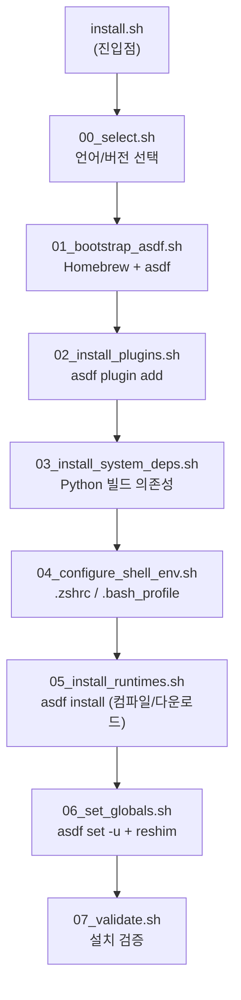

<div align="center">

# 🧰 langtoolchain

**macOS 한 줄 명령으로 Node.js · Java · Python · Rust · Go 컴파일러를 통째로 설치**

[](LICENSE)
[](#-사전-요구사항)
[](#-설계-원칙)
[](https://asdf-vm.com)

`git clone`도, 수동 설치도 필요 없습니다. 터미널에 한 줄 붙여넣으면 끝.

</div>

<br>

```zsh
curl -fsSL https://raw.githubusercontent.com/amosQP/langtoolchain/main/install.sh | bash
```

<br>

## 왜 만들었나

새 Mac을 받을 때마다 Homebrew 깔고, asdf 깔고, 언어별 플러그인 추가하고, 컴파일 플래그 맞춰서 `.zshrc` 고치고… 매번 똑같은 삽질을 반복하는 게 지겨워서 만들었습니다. **이제는 한 줄이면 됩니다.** Homebrew도 없으면 알아서 깔고, asdf도 알아서 깔고, 원하는 언어만 체크하듯 골라서 설치하고, 셸 설정까지 자동으로 끝납니다.

- 🍺 **Homebrew 없어도 OK** — 없으면 공식 스크립트로 자동 설치 (sudo 비밀번호만 직접 입력)
- ☑️ **체크박스 같은 대화형 설치** — 언어별로 설치 여부와 버전을 확인하고 골라서 설치
- 🌐 **`curl | bash` 완전 지원** — 로컬에 아무것도 없어도 원격 저장소를 알아서 clone해서 실행
- 🧩 **독립적인 모듈 구조** — 각 단계가 서로 의존하지 않아서, 필요한 부분만 골라 읽고 고치기 쉬움
- 🔙 **깔끔한 제거** — 설치한 건 전부 되돌릴 수 있음 (`.bak` 백업까지 남김)
- 🖥️ **bash 3.2 호환** — macOS 기본 셸에서도 그대로 동작

<br>

## 목차

- [빠른 시작](#-빠른-시작)
- [사전 요구사항](#-사전-요구사항)
- [설치되는 것](#-설치되는-것)
- [어떻게 동작하는가](#%EF%B8%8F-어떻게-동작하는가)
- [파일시스템 명세](#-설치하면-어디에-뭐가-생기는가-파일시스템-명세)
- [설치 확인 / 제거](#-설치-확인)
- [코드 구조](#-코드-구조-파일별-설명)
- [설계 원칙](#-설계-원칙)
- [기여하기](#-기여하기)
- [License](#-license)

<br>

## 🚀 빠른 시작

```zsh
curl -fsSL https://raw.githubusercontent.com/amosQP/langtoolchain/main/install.sh | bash
```

로컬에 이미 클론해뒀다면:

```zsh
git clone https://github.com/amosQP/langtoolchain.git && cd langtoolchain
./install.sh
```

실행하면 언어별로 설치할지 물어보고(Enter = 예), 버전을 확인/수정할 수 있게 한 뒤, 마지막에 "설치할까요?"로 한 번 더 확인하고 나서 실제 설치를 시작합니다.

```text
== 설치할 언어를 선택하세요 (Enter = 예) ==

nodejs (node) 설치할까요? [Y/n] > ⏎
  버전 [기본값: lts] > ⏎

java (java) 설치할까요? [Y/n] > n

python (python) 설치할까요? [Y/n] > ⏎
  버전 [기본값: 3.12.13] > ⏎
...
== 설치 목록 ==
  nodejs  lts
  python  3.12.13
  rust    1.94.0
  golang  1.26.1

설치할까요? [Y/n] > ⏎
```

<details>
<summary><b>옵션 플래그</b> (<code>curl | bash -s -- &lt;옵션&gt;</code> 형태로 전달 가능)</summary>
<br>

| 플래그 | 대상 | 동작 |
|---|---|---|
| `--all` | install | 언어 선택 화면 없이 `.tool-versions`에 있는 걸 전부 설치 |
| `--yes` | install / uninstall | 마지막 확인 프롬프트를 건너뜀 |
| `--dry-run` | install / uninstall | 실제로 아무것도 바꾸지 않고, 뭘 할지만 출력 |

> 터미널(tty)이 없는 환경(CI 등)에서 실행하면 자동으로 `--all`처럼 동작합니다 — 입력을 기다리다 멈추지 않습니다.

</details>

<br>

## 📋 사전 요구사항

| 필요한 것 | 없으면? |
|---|---|
| macOS | 이 도구는 macOS 전용입니다 |
| `git` (원격 설치 시) | Xcode Command Line Tools에 기본 포함 |
| ~~Homebrew~~ | 없으면 설치기가 알아서 설치합니다 (sudo 비밀번호는 직접 입력 필요) |
| ~~asdf~~ | 없으면 `brew install asdf`로 알아서 설치합니다 |

<br>

## 📦 설치되는 것

`.tool-versions`에 정의된 기본 언어/버전 — 설치 화면에서 개별적으로 켜고 끄거나 버전을 바꿀 수 있습니다.

| 언어 | 기본 버전 |
|---|---|
| 🟩 Node.js | `lts` |
| ☕ Java (Temurin) | `temurin-25.0.2+10.0.LTS` |
| 🐍 Python | `3.12.13` |
| 🦀 Rust | `1.94.0` |
| 🐹 Go | `1.26.1` |

Python 컴파일에 필요한 Homebrew 패키지(`openssl`, `readline`, `sqlite3`, `xz`, `zlib`, `tcl-tk`)도 함께 설치됩니다.

<br>

## ⚙️ 어떻게 동작하는가



1. **진입점 (`install.sh`)** — 로컬에 클론된 상태로 실행됐으면(`scripts/install/` 디렉토리가 옆에 있으면) 바로 그걸 실행합니다. `curl | bash`로 stdin을 통해 실행된 경우엔(로컬에 아무 파일도 없는 경우) `git clone --depth 1`로 임시 디렉토리(`mktemp -d`)에 저장소를 내려받은 뒤 그 안의 스크립트를 실행하고, 끝나면 `trap`으로 임시 디렉토리를 지웁니다.
2. **언어 선택 (`00_select.sh`)** — 언어별로 설치 여부(Y/n)와 버전을 물어봅니다. 모든 프롬프트/출력은 `/dev/tty`에 직접 쓰고 읽어서, `curl | bash`처럼 표준입력이 이미 스크립트 내용으로 막혀 있어도 정상적으로 사용자 입력을 받습니다. 결과는 `.tool-versions` 형식의 임시 파일로 저장되고, 그 파일 경로만 표준출력으로 반환됩니다. 터미널이 없으면(CI 등) 자동으로 전체 설치로 폴백합니다.
3. **Homebrew/asdf 부트스트랩 (`01_bootstrap_asdf.sh`)** — Homebrew가 없으면 공식 설치 스크립트를 `NONINTERACTIVE=1`로 실행해 직접 설치합니다(sudo 비밀번호 입력은 그대로 필요). `asdf`가 없으면 `brew install asdf`로 설치합니다.
4. **플러그인 설치 (`02_install_plugins.sh`)** — 선택된 언어마다 `asdf plugin add`.
5. **시스템 의존성 (`03_install_system_deps.sh`)** — Python 컴파일에 필요한 Homebrew 패키지 설치.
6. **셸 환경변수 (`04_configure_shell_env.sh`)** — `~/.zshrc` 또는 `~/.bash_profile`(사용자의 로그인 셸에 따라 자동 판단)에 asdf shim PATH, Java 홈, 컴파일러 플래그를 멱등적으로(중복 없이) 추가합니다.
7. **런타임 설치 (`05_install_runtimes.sh`)** — `asdf install <plugin> <version>` — 실제로 시간이 오래 걸리는 컴파일/다운로드 단계.
8. **전역 버전 지정 (`06_set_globals.sh`)** — `asdf set -u`로 전역 버전을 고정하고 `asdf reshim`으로 shim을 재생성.
9. **검증 (`07_validate.sh`)** — 각 언어의 바이너리가 PATH에서 실제로 asdf shim을 통해 잡히는지, 버전이 올바른지 확인.

> **핵심 설계 원칙**: 각 단계는 `main.sh`가 별도의 `bash` 프로세스로 순서대로 실행합니다. **어느 한 단계도 다른 단계가 먼저 실행되어 뭔가를 `export`해뒀을 거라고 가정하지 않습니다.** 예를 들어 5번(런타임 설치)은 4번이 `.zshrc`에 PATH를 써놨다고 믿는 대신, 스스로 `ensure_asdf_on_path`/`ensure_build_flags`를 호출해 필요한 환경을 그 자리에서 만듭니다. 그래서 특정 단계 하나만 따로 실행해도(`bash scripts/install/05_install_runtimes.sh`) 정상 동작합니다.

<br>

## 🗂️ 설치하면 어디에 뭐가 생기는가 (파일시스템 명세)

### 언어별 실제 설치 위치

전부 asdf가 관리하며, 아래 두 경로 규칙을 따릅니다.

| 언어 | plugin 이름 | 설치 디렉토리 (`asdf install`) | shim (PATH가 실제로 가리키는 것) |
|---|---|---|---|
| 🟩 Node.js | `nodejs` | `~/.asdf/installs/nodejs/<version>/` | `~/.asdf/shims/node`, `npm`, `npx` 등 |
| ☕ Java | `java` | `~/.asdf/installs/java/<version>/` | `~/.asdf/shims/java`, `javac` 등 |
| 🐍 Python | `python` | `~/.asdf/installs/python/<version>/` | `~/.asdf/shims/python`, `pip` 등 |
| 🦀 Rust | `rust` | `~/.asdf/installs/rust/<version>/` | `~/.asdf/shims/rustc`, `cargo` 등 |
| 🐹 Go | `golang` | `~/.asdf/installs/golang/<version>/` | `~/.asdf/shims/go`, `gofmt` 등 |

> `<version>`은 `.tool-versions`에 적힌 그대로의 문자열입니다 — 예를 들어 `nodejs`는 실제로 `~/.asdf/installs/nodejs/lts/`처럼 `lts`라는 이름의 디렉토리가 그대로 생깁니다. 각 언어 플러그인 자체의 소스는 `~/.asdf/plugins/<plugin>/`에 따로 있습니다.

### 공용 asdf 상태 (`$ASDF_DATA_DIR`, 기본값 `~/.asdf/`)

| 경로 | 내용 |
|---|---|
| `~/.asdf/plugins/` | 각 언어 플러그인의 git 체크아웃 |
| `~/.asdf/installs/` | 실제 컴파일된 런타임들 (위 표) |
| `~/.asdf/downloads/` | 설치 중 받은 소스/바이너리 캐시 |
| `~/.asdf/shims/` | PATH가 실제로 가리키는 얇은 래퍼 실행파일들 |

### 설정이 저장되는 곳

| 파일 | 무엇이 들어가는가 | 어느 스크립트가 쓰는가 |
|---|---|---|
| `~/.tool-versions` (전역 — 이 저장소의 `.tool-versions`와는 다른 파일) | 언어별 전역 기본 버전 | `06_set_globals.sh`의 `asdf set -u` |
| `~/.zshrc` 또는 `~/.bash_profile` (로그인 셸에 따라 자동 선택) | `eval "$(brew shellenv)"`(파일 맨 위에 prepend), `ASDF_DATA_DIR`/PATH shim export, Java 홈 훅, `LDFLAGS`/`CPPFLAGS`/`PKG_CONFIG_PATH` | `04_configure_shell_env.sh` |
| 이 저장소의 `.tool-versions` | **읽기 전용** — 언어/기본 버전 목록의 소스. 설치기가 여기에 쓰지 않음 | 모든 phase 스크립트가 읽기만 함 |

### Homebrew로 설치되는 것 (`/opt/homebrew/` 아래, Apple Silicon 기준)

`asdf` · `openssl` · `readline` · `sqlite3` · `xz` · `zlib` · `tcl-tk`

### 임시로만 쓰이는 것

- **언어 선택 결과 파일**: `mktemp -t langtoolchain-selection`으로 시스템 임시 디렉토리(`$TMPDIR`)에 생성, 설치 완료 후 `main.sh`가 삭제
- **`curl | bash` 실행 시의 저장소 클론**: `mktemp -d`로 임시 디렉토리에 clone, 스크립트 종료 시 `trap`으로 자동 삭제

### 제거 시 지워지는 것 (`uninstall.sh`)

`~/.asdf/` 전체(위 표의 모든 내용) · Homebrew로 설치된 `asdf`/`openssl`/`readline`/`sqlite3`/`xz`/`zlib`/`tcl-tk` · `~/.tool-versions`(전역) · `~/.zshrc`/`~/.bash_profile`/`~/.bashrc`에 추가됐던 줄들(`sed -i '.bak'`로 지우며 백업은 `<파일>.bak`로 남김).

> ⚠️ **이 저장소 자신의 `.tool-versions`는 절대 건드리지 않습니다.**

<br>

## ✅ 설치 확인

```zsh
source ~/.zshrc   # 또는 새 터미널 탭
node -v && java -version && python --version && rustc --version && go version
which node java python rustc go   # ~/.asdf/shims/... 아래를 가리켜야 정상
```

<br>

## 🗑️ 제거

```zsh
curl -fsSL https://raw.githubusercontent.com/amosQP/langtoolchain/main/uninstall.sh | bash
```

실행 전 한 번 확인을 물으며(`--yes`로 생략 가능), `--dry-run`도 동일하게 지원합니다. 제거 후에는 `exec $SHELL`로 새 셸 세션을 열어야 PATH 등 캐시된 상태가 완전히 사라집니다.

<br>

## 📁 코드 구조 (파일별 설명)

```
langtoolchain/
├── install.sh              ⇐ curl 진입점
├── uninstall.sh             ⇐ curl 진입점 (제거용)
├── .tool-versions            기본 언어/버전 목록 (읽기 전용 소스)
├── LICENSE                   MIT
└── scripts/
    ├── lib.sh                공용 유틸리티 모듈
    ├── install/               설치 단계 (역할별 파일 분리)
    │   ├── 00_select.sh
    │   ├── 01_bootstrap_asdf.sh
    │   ├── 02_install_plugins.sh
    │   ├── 03_install_system_deps.sh
    │   ├── 04_configure_shell_env.sh
    │   ├── 05_install_runtimes.sh
    │   ├── 06_set_globals.sh
    │   ├── 07_validate.sh
    │   └── main.sh
    └── uninstall/             제거 단계 (동일한 패턴)
        ├── 01_uninstall_runtimes.sh
        ├── 02_remove_plugins.sh
        ├── 03_clean_env_vars.sh
        ├── 04_remove_system_deps.sh
        ├── 05_purge_asdf_core.sh
        ├── 06_validate_teardown.sh
        └── main.sh
```

### 루트

| 파일 | 역할 |
|---|---|
| `install.sh` | curl 진입점. 로컬 클론이면 `scripts/install/main.sh`를 바로 실행, 아니면 `git clone`으로 임시 디렉토리에 받아서 실행 |
| `uninstall.sh` | 위와 동일한 패턴의 제거용 진입점 (`scripts/uninstall/main.sh` 호출) |
| `.tool-versions` | 기본으로 설치할 언어/버전 목록. asdf의 표준 포맷(`플러그인 버전`)을 그대로 씀 — 언어를 추가/변경하려면 이 파일 한 줄만 고치면 됨 |

### `scripts/lib.sh`

모든 phase 스크립트가 공유하는 순수 함수 모음. 이 파일 하나를 소스(source)하는 것 외에는 phase 스크립트끼리 서로 의존하지 않습니다.

| 함수 | 역할 |
|---|---|
| `log`, `step`, `die` | 로그 출력, 섹션 헤더 출력, 에러 후 즉시 종료 |
| `run` | `--dry-run`이면 명령을 출력만 하고, 아니면 실제로 실행 |
| `repo_root_from` | 스크립트 자기 자신의 경로로부터 저장소 루트를 역산 |
| `each_tool` | `.tool-versions` 형식 파일을 `플러그인 버전` 쌍으로 파싱 |
| `detect_rc_file` | `$SHELL` 기준으로 `.zshrc`/`.bash_profile` 중 무엇을 고칠지 결정 |
| `append_env_var` | rc 파일 맨 **끝**에 줄을 멱등적으로(중복 없이) 추가 |
| `prepend_env_var` | rc 파일 맨 **앞**에 줄을 멱등적으로 추가 — PATH 우선순위가 중요한 줄(`brew shellenv`)에 사용 |
| `ensure_asdf_on_path` | 이 프로세스에서 asdf/shim이 PATH에 잡히도록 보장 |
| `ensure_brew_on_path` | 이 프로세스에서 `brew`가 PATH에 잡히도록 보장 (Apple Silicon/Intel 설치 경로 자동 판단) |
| `ensure_build_flags` | Python 등 컴파일에 필요한 `LDFLAGS`/`CPPFLAGS`/`PKG_CONFIG_PATH`를 이 프로세스에 export |
| `binary_for_plugin`, `flag_for_binary` | plugin 이름 ↔ 실제 실행파일 이름 ↔ 버전 확인 플래그 매핑 (bash 3.2엔 연관 배열이 없어서 `case`로 구현) |

### `scripts/install/`

| 파일 | 역할 |
|---|---|
| `00_select.sh` | 언어별 설치 여부/버전을 물어보는 대화형 선택기. `/dev/tty`로 직접 읽고 써서 `curl \| bash`에서도 동작. 결과를 임시 `.tool-versions` 파일로 반환 |
| `01_bootstrap_asdf.sh` | Homebrew 없으면 공식 스크립트로 설치(sudo 필요), `asdf` 없으면 `brew install asdf` |
| `02_install_plugins.sh` | 선택된 언어마다 `asdf plugin add` |
| `03_install_system_deps.sh` | Python 컴파일용 Homebrew 패키지 설치 |
| `04_configure_shell_env.sh` | rc 파일에 asdf/빌드 환경변수 기록 |
| `05_install_runtimes.sh` | `asdf install` — 실제 컴파일/다운로드 |
| `06_set_globals.sh` | `asdf set -u` + `asdf reshim` |
| `07_validate.sh` | 설치 결과 검증 (바이너리 경로, 버전 출력) |
| `main.sh` | 위 스크립트들을 순서대로 실행하는 오케스트레이터. `--dry-run`/`--all`/`--yes` 플래그 처리 |

### `scripts/uninstall/`

설치의 역순, 동일한 독립 실행 원칙.

| 파일 | 역할 |
|---|---|
| `01_uninstall_runtimes.sh` | `asdf uninstall`로 설치된 런타임 제거 |
| `02_remove_plugins.sh` | 설치된 모든 asdf 플러그인 제거 |
| `03_clean_env_vars.sh` | rc 파일들에서 이 도구가 추가한 줄 제거 (`.bak` 백업 남김) |
| `04_remove_system_deps.sh` | Homebrew 시스템 패키지 제거 |
| `05_purge_asdf_core.sh` | `asdf` 자체와 `~/.asdf/`, 전역 `~/.tool-versions` 제거 |
| `06_validate_teardown.sh` | 제거 결과 검증 |
| `main.sh` | 위를 순서대로 실행 + 실행 전 확인 프롬프트 |

<br>

## 🧠 설계 원칙

기여하기 전에 알아두면 좋은 것들입니다.

<details>
<summary><b>1. 각 phase는 서로 독립적입니다 — export에 의존하지 않음</b></summary>
<br>

각 phase 스크립트는 `main.sh`가 별도의 `bash` 프로세스로 실행합니다. 즉 한 phase에서 `export`한 값은 다음 phase로 자동으로 넘어가지 않습니다. 그래서 `asdf`나 빌드 플래그가 필요한 스크립트는 각자 `ensure_asdf_on_path`/`ensure_build_flags`를 직접 호출합니다. 이 원칙 덕분에 아무 phase나 단독으로(`bash scripts/install/05_install_runtimes.sh`) 실행해도 정상 동작하고, 순서를 바꾸거나 phase를 추가/삭제하기도 쉽습니다.
</details>

<details>
<summary><b>2. .tool-versions를 읽는 루프는 표준입력이 아니라 fd 3을 씁니다</b></summary>
<br>

`.tool-versions`를 파싱해서 `while read ...; do ... done` 루프를 도는 코드는 항상 `3< <(each_tool "$CONFIG_FILE")` 형태로 파일디스크립터 3번을 씁니다. 루프 안에서 `asdf` 같은 외부 명령을 또 실행하기 때문인데, 표준입력을 그대로 쓰면 그 명령이 실수로 루프용 입력을 가로챌 수 있어서입니다.
</details>

<details>
<summary><b>3. 파이프를 곧장 grep -q로 넘기지 않습니다 (pipefail + SIGPIPE)</b></summary>
<br>

`asdf plugin list | grep -q ...`처럼 "명령 출력을 곧장 `grep -q`로 파이프"하는 패턴은 `set -o pipefail`과 함께 쓰면 위험합니다 — `grep -q`가 매치되자마자 파이프를 일찍 닫아버리는데, 그 타이밍에 상류 명령이 아직 출력 중이면 SIGPIPE로 죽고 파이프라인 전체가 실패로 보고됩니다. 명령 출력은 변수에 먼저 담고, 그 변수를 grep하세요.
</details>

<details>
<summary><b>4. bash 3.2 호환을 유지합니다</b></summary>
<br>

macOS 기본 `/bin/bash`는 여전히 3.2입니다(라이선스 문제로 Apple이 업그레이드하지 않음). 연관 배열(`declare -A`) 같은 bash 4+ 전용 문법을 쓰지 않습니다 — `curl | bash`로 실행될 때 어떤 `bash`가 PATH에 잡힐지 보장할 수 없기 때문입니다.
</details>

<details>
<summary><b>5. rc 파일에 PATH 줄을 추가할 땐 순서가 실제로 우선순위를 결정합니다</b></summary>
<br>

셸이 파일을 위에서부터 소싱하면서 매번 `export PATH="X:$PATH"`로 앞에 붙이기 때문에, **더 나중에 소싱되는 줄이 PATH 우선순위가 더 높습니다.** `brew shellenv`처럼 "제일 먼저 소싱되어야 하는" 줄은 `append_env_var`(파일 끝에 추가)가 아니라 `prepend_env_var`(파일 맨 앞에 추가)로 넣어야, 그 뒤에 오는 asdf shim PATH 줄이 항상 마지막에 prepend되어 우선순위를 가져갑니다.
</details>

<br>

## 🤝 기여하기

- 언어/버전을 바꾸려면 `.tool-versions` 한 줄만 수정하면 됩니다.
- 특정 단계만 고치거나 디버깅할 땐 개별 실행: `DRY_RUN=true bash scripts/install/05_install_runtimes.sh`
- 전체 문법 검사: `for f in install.sh uninstall.sh scripts/lib.sh scripts/install/*.sh scripts/uninstall/*.sh; do bash -n "$f"; done`
- 실제로 아무것도 바꾸지 않고 전체 흐름 확인: `./install.sh --dry-run --all --yes`, `./uninstall.sh --dry-run --yes`

**남은 To-Do**
- [x] 실기기에서 `--dry-run` 없이 실제 설치 검증 (새 Node 버전을 실제로 설치/제거하며 phase 1~5, 7 검증)
- [ ] 진짜 클린 macOS(VM 또는 새 계정)에서 Homebrew 자동 설치 경로까지 포함해 처음부터 전체 검증
- [ ] Intel Mac(`/usr/local` 접두사) 경로 처리 확인 — 코드는 `uname -m` 분기로 처리해뒀지만 Intel 기기에서 직접 검증은 안 함

<br>

## 📝 License

<div align="center">

[MIT](LICENSE) — 누구나 자유롭게 가져다 쓰고 고칠 수 있습니다.

Made with 🧉 by [amosQP](https://github.com/amosQP)

</div>
