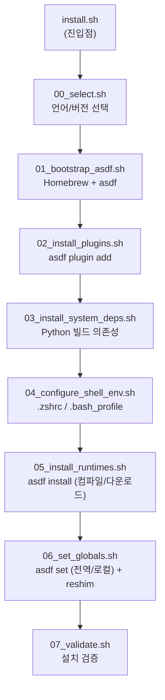

<div align="center">

# 🧰 langtoolchain

**macOS 한 줄 명령으로 Node.js · Java · Python · Rust · Go 컴파일러를 통째로 설치**

[](https://opensource.org/licenses/MIT)
[](#-사전-요구사항)
[](#-설계-원칙)
[](https://asdf-vm.com)

**한국어** | [English](readme.en.md)

`git clone`도, 수동 설치도 필요 없습니다. 터미널에 한 줄 붙여넣으면 끝.

</div>

<br>

```zsh
curl -fsSL https://raw.githubusercontent.com/amosQP/langtoolchain/main/install.sh | sh
```

<br>

## 왜 만들었나

새 Mac마다 Homebrew·asdf 설치, 플러그인 추가, `.zshrc` 손보기를 반복하는 게 지겨워서 만들었습니다. **이제는 한 줄이면 됩니다.** Homebrew·asdf 설치부터 언어 선택, 셸 설정까지 전부 자동입니다.

- 🍺 **Homebrew 없어도 OK** — 없으면 공식 스크립트로 자동 설치 (sudo 비밀번호만 직접 입력)
- ☑️ **체크박스 같은 대화형 설치** — 언어별로 설치 여부와 버전을 확인하고 골라서 설치
- 🌐 **`curl | sh` 완전 지원** — 로컬에 아무것도 없어도 원격 저장소를 알아서 clone해서 실행
- 🌍 **전역 or 디렉토리별 버전 고정** — 시스템 전체 기본값으로도, 특정 프로젝트에만도 자유롭게
- 🧩 **독립적인 모듈 구조** — 각 단계가 서로 의존하지 않아서, 필요한 부분만 골라 읽고 고치기 쉬움
- 🔙 **깔끔한 제거** — 설치한 건 전부 되돌릴 수 있음 (`.bak` 백업까지 남김)
- 🔁 **네트워크 재시도 + 부분 실패 격리** — 일시적 네트워크 장애는 자동 재시도, 언어 하나가 실패해도 나머지는 계속 설치 시도
- 🖥️ **POSIX sh 호환** — macOS 기본 셸(`/bin/sh`)에서도 그대로 동작, bash 특수문법 없음

<br>

## 📦 관리 범위

langtoolchain이 설치·관리하는 건 **Node.js·Java·Python·Rust·Go 5개 언어**(+ 각 언어의 동반 도구인
pnpm·gradle)와 그걸 위한 Homebrew 패키지 6개(`asdf`, `openssl` 등)뿐입니다. 그 외에 Mac에 이미
있거나 앞으로 `brew install`할 다른 패키지, 이 도구가 설치하지 않은 다른 asdf 플러그인은 **install
쪽에서는** 전혀 건드리지 않습니다.

| | langtoolchain이 관리 | 관리 안 함 |
|---|---|---|
| 🍺 Homebrew | `asdf` + 컴파일용 시스템 패키지 6개 | 그 외 모든 `brew` 패키지 |
| 🧬 asdf | `nodejs`/`java`/`python`/`rust`/`golang` + 동반 도구 `pnpm`(nodejs)/`gradle`(java) 플러그인 | 다른 언어·도구용 플러그인 (단, uninstall은 예외 — 아래 참고) |
| 🗂️ 버전 고정 | 고른 언어(+동반 도구)를, 고른 범위(전역/디렉토리)에만 | 나머지 프로젝트·설정 |

> ⚠️ **uninstall은 예외입니다**: asdf 자체를 통째로 지우기 때문에, langtoolchain이 설치하지 않은
> 다른 asdf 플러그인이 있어도 `~/.asdf/` 전체와 함께 지워집니다 — 자세한 내용은 아래 "제거 시
> 지워지는 것" 섹션 참고. install 쪽 "관리 안 함"과 uninstall의 실제 동작이 다르다는 점에 유의하세요.

**pnpm/gradle이 동반 도구인 이유**: nodejs·java의 asdf 플러그인은 각각 순수 Node 런타임/JDK만
설치할 뿐 별도 패키지·빌드 매니저가 없어서, 실제 프로젝트에는 pnpm(node)이나 gradle(java)이 거의
필수급으로 따라붙습니다. 반대로 Rust는 asdf-rust가 cargo를 이미 번들로 포함하고, Go도 `go` 자체에
모듈/빌드 기능이 내장돼 있어서 별도 동반 도구가 없습니다 — 그래서 이 둘만 있습니다.

<br>

## 목차

- [빠른 참조 (자주 쓰는 명령어)](#-빠른-참조-자주-쓰는-명령어)
- [빠른 시작](#-빠른-시작)
- [관리 범위](#-관리-범위)
- [사전 요구사항](#-사전-요구사항)
- [설치되는 것](#-설치되는-것)
- [어떻게 동작하는가](#%EF%B8%8F-어떻게-동작하는가)
- [버전 고정 범위: 전역 vs 디렉토리별](#-버전-고정-범위-전역-vs-디렉토리별)
- [파일시스템 명세](#-설치하면-어디에-뭐가-생기는가-파일시스템-명세)
- [설치 확인 / 제거](#-설치-확인)
- [코드 구조](#-코드-구조-파일별-설명)
- [설계 원칙](#-설계-원칙)
- [기여하기](#-기여하기)
- [알려진 한계 / 앞으로 할 일](#-알려진-한계--앞으로-할-일)
- [License](#-license)

<br>

## 📎 빠른 참조 (자주 쓰는 명령어)

나중에 명령어가 기억 안 날 때 이 섹션만 보면 되도록, 존재하는 옵션과 사용법을 전부 모아뒀습니다.

### 설치

`curl -fsSL <url> | sh` 뒤에 `-s -- <옵션>`을 붙이면 됩니다. 옵션은 여러 개를 동시에 조합할 수 있습니다.

```zsh
# 대화형 (언어별로 설치 여부/버전/고정 범위를 물어봄) — 옵션 없이 그냥 실행
curl -fsSL https://raw.githubusercontent.com/amosQP/langtoolchain/main/install.sh | sh

# --all: 언어 선택 화면 없이 .tool-versions에 있는 걸 전부 설치 (버전/고정 범위는 여전히 물어봄)
curl -fsSL https://raw.githubusercontent.com/amosQP/langtoolchain/main/install.sh | sh -s -- --all

# --yes: 마지막 "설치할까요?" 확인만 건너뜀 (언어 선택은 여전히 대화형)
curl -fsSL https://raw.githubusercontent.com/amosQP/langtoolchain/main/install.sh | sh -s -- --yes

# --all --yes: 질문 전혀 없이 전부 자동 설치 (스크립트/CI에서 주로 이 조합)
curl -fsSL https://raw.githubusercontent.com/amosQP/langtoolchain/main/install.sh | sh -s -- --all --yes

# --dry-run: 실제로 뭘 할지만 출력하고 아무것도 안 바꿈 (다른 옵션과 자유롭게 조합 가능)
curl -fsSL https://raw.githubusercontent.com/amosQP/langtoolchain/main/install.sh | sh -s -- --dry-run --all --yes

# --local: 전역 대신 "현재 디렉토리"에만 버전 고정 (대화형 스코프 질문도 스킵)
curl -fsSL https://raw.githubusercontent.com/amosQP/langtoolchain/main/install.sh | sh -s -- --local

# --local=<dir>: 지정한 디렉토리에만 버전 고정
curl -fsSL https://raw.githubusercontent.com/amosQP/langtoolchain/main/install.sh | sh -s -- --local=/path/to/project

# 로컬에 이미 클론해뒀다면 curl | sh 대신 그냥 이렇게 (옵션은 위와 동일하게 사용)
git clone https://github.com/amosQP/langtoolchain.git && cd langtoolchain
./install.sh                    # 또는 ./install.sh --all --yes 등 위 옵션 조합 그대로
```

> 터미널(tty)이 없는 환경(CI 등)에서는 옵션 없이 실행해도 자동으로 `--all`처럼 동작합니다.

### 설치 확인

```zsh
source ~/.zshrc                                    # 새 터미널 탭을 열어도 동일
node -v && java -version && python --version && rustc --version && go version
pnpm --version && gradle --version                  # 동반 도구도 설치했다면
which node java python rustc go pnpm gradle          # ~/.asdf/shims/... 아래를 가리켜야 정상
asdf current                                         # 지금 활성화된 버전 전체 목록
asdf current nodejs                                  # 특정 언어만
asdf list nodejs                                     # 이 머신에 설치된 nodejs 버전들
asdf list all nodejs                                 # 설치 가능한 전체 버전 목록 (설치 안 해도 조회 가능)
```

### 제거

```zsh
# 대화형 확인 후 제거
curl -fsSL https://raw.githubusercontent.com/amosQP/langtoolchain/main/uninstall.sh | sh

# 확인 없이 바로 제거
curl -fsSL https://raw.githubusercontent.com/amosQP/langtoolchain/main/uninstall.sh | sh -s -- --yes

# 제거 미리보기 (실제로 아무것도 안 지움)
curl -fsSL https://raw.githubusercontent.com/amosQP/langtoolchain/main/uninstall.sh | sh -s -- --dry-run --yes

# 로컬 클론에서
./uninstall.sh                  # 또는 ./uninstall.sh --yes / --dry-run --yes
```

제거 후에는 `exec $SHELL`로 새 셸 세션을 열어야 PATH 등 캐시된 상태가 완전히 사라집니다.

### 개별 단계만 실행 (디버깅/고급)

각 단계는 독립적으로 실행 가능합니다 — `DRY_RUN=true` 환경변수로 미리보기, `TOOL_VERSIONS_FILE=<경로>`로 이 저장소 기본값 대신 다른 설정 파일을 지정할 수 있습니다.

```zsh
DRY_RUN=true sh scripts/install/05_install_runtimes.sh      # 예: 런타임 설치 단계만 미리보기
TOOL_VERSIONS_FILE=/path/to/custom sh scripts/install/06_set_globals.sh   # 다른 설정 파일로
```

| install 단계 | uninstall 단계 |
|---|---|
| `00_select.sh` [자세히](#-코드-구조-파일별-설명) | `01_uninstall_runtimes.sh` |
| `01_bootstrap_asdf.sh` | `02_remove_plugins.sh` |
| `02_install_plugins.sh` | `03_clean_env_vars.sh` |
| `03_install_system_deps.sh` | `04_remove_system_deps.sh` |
| `04_configure_shell_env.sh` | `05_purge_asdf_core.sh` |
| `05_install_runtimes.sh` | `06_validate_teardown.sh` |
| `06_set_globals.sh` | |
| `07_validate.sh` | |

각 파일이 정확히 무슨 일을 하는지는 [코드 구조](#-코드-구조-파일별-설명) 참고.

### 문제 상황별 대응

| 상황 | 어떻게 |
|---|---|
| 설치/제거 도중 끊겼다 (네트워크, Ctrl-C) | 같은 명령을 그대로 다시 실행 — 이미 끝난 부분은 자동으로 건너뜀 |
| 설치할 언어나 버전을 바꾸고 싶다 | `.tool-versions` 파일 한 줄 수정 후 재설치 (또는 대화형 설치에서 직접 고르기) |
| 지금 뭐가 전역/로컬로 고정돼 있는지 보고 싶다 | `asdf current` |
| "다른 langtoolchain 설치/제거가 실행 중"이라고 뜬다 | 진짜 동시 실행 중인 게 없다면 에러 메시지가 알려주는 lock 디렉토리를 지우고 재시도 |
| "디스크 공간이 부족하다"고 뜬다 | `$HOME`이 있는 볼륨에 최소 5GB 이상 여유 공간을 확보한 뒤 재시도 |
| 언어 하나만 설치가 실패했다 | 나머지 언어는 이미 다 설치됐을 가능성이 높음 — 같은 설치 명령을 다시 실행하면 실패한 것만 재시도됨 |
| `--local`로 고정한 버전을 나중에 직접 바꾸고 싶다 | 그 디렉토리에서 `asdf set <plugin> <version>` 직접 실행 ([자세히](#-버전-고정-범위-전역-vs-디렉토리별)) |

<br>

## 🚀 빠른 시작

```zsh
curl -fsSL https://raw.githubusercontent.com/amosQP/langtoolchain/main/install.sh | sh
```

로컬에 이미 클론해뒀다면:

```zsh
git clone https://github.com/amosQP/langtoolchain.git && cd langtoolchain
./install.sh
```

언어별 설치 여부(Enter = 예)와 버전을 확인한 뒤, 마지막 확인을 거쳐 설치를 시작합니다.

```text
== Select languages to install (Enter = yes) ==

Install nodejs (node)? [Y/n] > ⏎
  Version [default: lts] > ⏎
  Also install pnpm (companion to nodejs)? [Y/n] > ⏎
    Version [default: 10.33.0] > ⏎

Install java (java)? [Y/n] > n

Install python (python)? [Y/n] > ⏎
  Version [default: 3.12.13] > ⏎
...
== Install list ==
  nodejs  lts
  pnpm    10.33.0
  python  3.12.13
  rust    1.94.0
  golang  1.26.1

Pin globally, or only in this directory? [global/local, default: global] > ⏎

Install? [Y/n] > ⏎
```

> 마지막 프롬프트는 이번에 설치한 버전을 **어디에** 활성화할지 고릅니다 — 자세한 내용은
> 바로 아래 [버전 고정 범위](#-버전-고정-범위-전역-vs-디렉토리별) 참고.
>
> 동반 도구(pnpm/gradle) 질문은 그 부모 언어(nodejs/java)를 수락했을 때만 따라 나옵니다 — 위
> 예시에서 java를 `n`으로 거절하니 gradle 질문 자체가 안 뜨는 걸 볼 수 있습니다.

<details>
<summary><b>옵션 플래그</b> (<code>curl | sh -s -- &lt;옵션&gt;</code> 형태로 전달 가능)</summary>
<br>

| 플래그 | 대상 | 동작 |
|---|---|---|
| `--all` | install | 언어 선택 화면 없이 `.tool-versions`에 있는 걸 전부 설치 |
| `--yes` | install / uninstall | 마지막 확인 프롬프트를 건너뜀 |
| `--dry-run` | install / uninstall | 실제로 아무것도 바꾸지 않고, 뭘 할지만 출력 |
| `--local` / `--local=<dir>` | install | 전역 대신 현재(또는 지정한) 디렉토리에만 버전 고정. [자세히 보기](#-버전-고정-범위-전역-vs-디렉토리별) |

> 터미널(tty)이 없는 환경(CI 등)에서 실행하면 자동으로 `--all`처럼 동작합니다 — 입력을 기다리다 멈추지 않습니다.

</details>

<br>

## 📋 사전 요구사항

| 필요한 것 | 없으면? |
|---|---|
| macOS | 이 도구는 macOS 전용입니다 |
| `git` (원격 설치 시) | Xcode Command Line Tools에 기본 포함 |
| ~~Homebrew~~ | 없으면 설치기가 알아서 설치합니다 (sudo 비밀번호는 직접 입력 필요) |
| ~~asdf~~ | 없으면 `brew install asdf`로 알아서 설치합니다 |

<br>

## 📦 설치되는 것

`.tool-versions`에 정의된 기본 언어/버전 — 설치 화면에서 개별적으로 켜고 끄거나 버전을 바꿀 수 있습니다.
동반 도구(pnpm/gradle)는 각각 그 부모 언어를 설치할 때만 물어보는 선택 사항입니다.

| 언어 / 동반 도구 | 기본 버전 |
|---|---|
| 🟩 Node.js | `lts` |
| &nbsp;&nbsp;└ pnpm (동반) | `10.33.0` |
| ☕ Java (Temurin) | `temurin-25.0.2+10.0.LTS` |
| &nbsp;&nbsp;└ gradle (동반) | `9.4.1` |
| 🐍 Python | `3.12.13` |
| 🦀 Rust | `1.94.0` |
| 🐹 Go | `1.26.1` |

Python 컴파일에 필요한 Homebrew 패키지(`openssl`, `readline`, `sqlite3`, `xz`, `zlib`, `tcl-tk`)도 함께 설치됩니다.

<br>

## ⚙️ 어떻게 동작하는가



1. **진입점 (`install.sh`)** — 로컬 클론이면 바로 실행. `curl | sh`면 `git clone --depth 1`로 임시 디렉토리에 받아 실행 후 `trap`으로 정리.
2. **언어 선택 (`00_select.sh`)** — 언어별 설치 여부·버전, 전역/로컬 고정 범위를 물어봅니다. `/dev/tty`로 직접 읽고 써서 `curl | sh`에서도 입력을 받습니다. 결과는 임시 `.tool-versions` 파일로 저장, 경로만 표준출력으로 반환. 터미널이 없으면 자동으로 전체 설치.
3. **Homebrew/asdf 부트스트랩 (`01_bootstrap_asdf.sh`)** — Homebrew 없으면 공식 스크립트로 설치(sudo 비밀번호 필요), asdf 없으면 `brew install asdf`.
4. **플러그인 설치 (`02_install_plugins.sh`)** — 선택된 언어마다 `asdf plugin add`.
5. **시스템 의존성 (`03_install_system_deps.sh`)** — Python 컴파일에 필요한 Homebrew 패키지 설치.
6. **셸 환경변수 (`04_configure_shell_env.sh`)** — 로그인 셸에 맞는 rc 파일에 asdf shim PATH, Java 홈, 컴파일러 플래그를 중복 없이 추가.
7. **런타임 설치 (`05_install_runtimes.sh`)** — `asdf install <plugin> <version>` — 가장 시간이 오래 걸리는 컴파일/다운로드 단계.
8. **버전 고정 (`06_set_globals.sh`)** — 정한 범위에 따라 `asdf set -u`(전역) 또는 `asdf set`(로컬) 실행 후 `asdf reshim`.
9. **검증 (`07_validate.sh`)** — 각 언어 바이너리가 asdf shim을 통해 잡히는지, 버전이 맞는지 확인.

> **핵심 설계 원칙**: 각 단계는 별도 `sh` 프로세스로 실행되어 서로의 `export`에 의존하지 않습니다. 5번은 4번이 PATH를 써놨다고 믿지 않고 `ensure_asdf_on_path`를 직접 호출합니다. 그래서 단계 하나만 따로 실행해도(`sh scripts/install/05_install_runtimes.sh`) 정상 동작합니다.

<br>

## 🌍 버전 고정 범위: 전역 vs 디렉토리별

asdf는 언어 런타임을 **한 번만 설치**하고(`~/.asdf/installs/<plugin>/<version>/`), `.tool-versions`
파일로 "지금 어떤 설치된 버전을 쓸지"만 결정합니다. 이 고정에는 두 가지 범위가 있습니다.

| 범위 | 저장 위치 | 실행되는 명령 | 적용 범위 |
|---|---|---|---|
| **전역 (Global)** | `~/.tool-versions` | `asdf set -u <plugin> <version>` | 딱히 지정 안 된 모든 디렉토리의 기본값 |
| **디렉토리별 (Local)** | `<지정 디렉토리>/.tool-versions` | `asdf set <plugin> <version>` (`-u` 없음) | 그 디렉토리(와 하위 디렉토리) 안에서만, 전역값보다 우선 |

예: 평소엔 최신 Node.js를 쓰다가 레거시 프로젝트 하나만 Node 18이 필요하면, 그 디렉토리에만 로컬로
고정하면 다른 곳엔 영향 없이 그 프로젝트에서만 적용됩니다.

> 💡 **비유로 설명하면**: nvm의 `.nvmrc`, pyenv의 `.python-version` 같은 "이 폴더는 이 버전 써" 파일을
> asdf는 언어 상관없이 전부 `.tool-versions` 하나로 통일한 것뿐입니다. 전역은 그게 없을 때의 기본값.

### 사용법

**대화형**: 설치 마지막 확인 직전에 물어봅니다 (Enter = 전역).
```text
Pin globally, or only in this directory? [global/local, default: global] > local
  Which directory? [default: current directory] > ⏎
```

**플래그** (비대화형, 프롬프트를 건너뜀):
```zsh
./install.sh --local                    # 현재 디렉토리에 고정
./install.sh --local=/path/to/project    # 지정한 디렉토리에 고정
./install.sh                             # (기본값) 전역에 고정
```

### 구현 방식

`00_select.sh`가 언어 선택과 함께 고정 범위도 물어본 뒤, 선택 결과 파일의 **첫 줄에 주석으로
기록**합니다:

```
# scope: global
nodejs lts
python 3.12.13
```
또는
```
# scope: local /Users/me/myproject
nodejs lts
```

`#`으로 시작하는 줄은 파싱에서 무시되므로 언어/버전 로직은 그대로입니다. `06_set_globals.sh`가
`read_scope()`(`scripts/lib.sh`)로 이 줄을 읽어 분기하고, 줄이 없으면 항상 전역으로 동작합니다.

### 이미 로컬로 고정된 걸 나중에 직접 다루고 싶다면

langtoolchain은 표준 asdf 명령을 대신 실행해줄 뿐입니다 — `.tool-versions`를 직접 열거나,
`asdf current`/`asdf set <plugin> <version>`을 직접 써도 됩니다. 따로 배울 전용 명령은 없습니다.

<br>

## 🗂️ 설치하면 어디에 뭐가 생기는가 (파일시스템 명세)

### 언어별 실제 설치 위치

전부 asdf가 관리하며, 아래 두 경로 규칙을 따릅니다.

| 언어 | plugin 이름 | 설치 디렉토리 (`asdf install`) | shim (PATH가 실제로 가리키는 것) |
|---|---|---|---|
| 🟩 Node.js | `nodejs` | `~/.asdf/installs/nodejs/<version>/` | `~/.asdf/shims/node`, `npm`, `npx` 등 |
| &nbsp;&nbsp;└ pnpm (동반) | `pnpm` | `~/.asdf/installs/pnpm/<version>/` | `~/.asdf/shims/pnpm` |
| ☕ Java | `java` | `~/.asdf/installs/java/<version>/` | `~/.asdf/shims/java`, `javac` 등 |
| &nbsp;&nbsp;└ gradle (동반) | `gradle` | `~/.asdf/installs/gradle/<version>/` | `~/.asdf/shims/gradle` |
| 🐍 Python | `python` | `~/.asdf/installs/python/<version>/` | `~/.asdf/shims/python`, `pip` 등 |
| 🦀 Rust | `rust` | `~/.asdf/installs/rust/<version>/` | `~/.asdf/shims/rustc`, `cargo` 등 |
| 🐹 Go | `golang` | `~/.asdf/installs/golang/<version>/` | `~/.asdf/shims/go`, `gofmt` 등 |

> `<version>`은 `.tool-versions`에 적힌 그대로의 문자열입니다 — 예를 들어 `nodejs`는 실제로 `~/.asdf/installs/nodejs/lts/`처럼 `lts`라는 이름의 디렉토리가 그대로 생깁니다. 각 언어 플러그인 자체의 소스는 `~/.asdf/plugins/<plugin>/`에 따로 있습니다.

### 공용 asdf 상태 (`$ASDF_DATA_DIR`, 기본값 `~/.asdf/`)

| 경로 | 내용 |
|---|---|
| `~/.asdf/plugins/` | 각 언어 플러그인의 git 체크아웃 |
| `~/.asdf/installs/` | 실제 컴파일된 런타임들 (위 표) |
| `~/.asdf/downloads/` | 설치 중 받은 소스/바이너리 캐시 |
| `~/.asdf/shims/` | PATH가 실제로 가리키는 얇은 래퍼 실행파일들 |
| `~/.asdf/langtoolchain-local-pins` | `--local`로 고정한 디렉토리 경로 목록 — uninstall이 로컬 전용 버전도 찾아 지울 수 있게 함 |

### 설정이 저장되는 곳

| 파일 | 무엇이 들어가는가 | 어느 스크립트가 쓰는가 |
|---|---|---|
| `~/.tool-versions` (전역 — 이 저장소의 `.tool-versions`와는 다른 파일) | 언어별 전역 기본 버전 | `06_set_globals.sh`의 `asdf set -u` (기본, 또는 `--local` 없이 실행 시) |
| `<지정 디렉토리>/.tool-versions` (`--local` 사용 시에만) | 그 디렉토리 안에서만 적용되는 버전 | `06_set_globals.sh`의 `asdf set` — [버전 고정 범위](#-버전-고정-범위-전역-vs-디렉토리별) 참고 |
| `~/.zshrc` 또는 `~/.bash_profile` (로그인 셸에 따라 자동 선택) | `eval "$(brew shellenv)"`(파일 맨 위에 prepend), `ASDF_DATA_DIR`/PATH shim export, Java 홈 훅, `LDFLAGS`/`CPPFLAGS`/`PKG_CONFIG_PATH` | `04_configure_shell_env.sh` |
| 이 저장소의 `.tool-versions` | **읽기 전용** — 언어/기본 버전 목록의 소스. 설치기가 여기에 쓰지 않음 | 모든 phase 스크립트가 읽기만 함 |

### Homebrew로 설치되는 것 (`/opt/homebrew/` 아래, Apple Silicon 기준)

`asdf` · `openssl` · `readline` · `sqlite3` · `xz` · `zlib` · `tcl-tk`

### 임시로만 쓰이는 것

- **언어 선택 결과 파일**: `mktemp -t langtoolchain-selection`으로 시스템 임시 디렉토리(`$TMPDIR`)에 생성, 설치 완료 후 `main.sh`가 삭제
- **`curl | sh` 실행 시의 저장소 클론**: `mktemp -d`로 임시 디렉토리에 clone, 스크립트 종료 시 `trap`으로 자동 삭제
- **동시 실행 방지 lock**: `$TMPDIR/langtoolchain.lock` — install/uninstall 시작 시 생성, 끝나면 `trap`으로 삭제. install↔uninstall 사이에도 공유되는 lock이라 서로 동시 실행도 막음

### 제거 시 지워지는 것 (`uninstall.sh`)

`~/.asdf/` 전체(위 표의 모든 내용) · Homebrew로 설치된 `asdf`/`openssl`/`readline`/`sqlite3`/`xz`/`zlib`/`tcl-tk` · `~/.tool-versions`(전역) · `~/.zshrc`/`~/.bash_profile`/`~/.bashrc`에 추가됐던 줄들(`sed -i '.bak'`로 지우며 백업은 `<파일>.bak`로 남김).

> ⚠️ **이 저장소 자신의 `.tool-versions`는 절대 건드리지 않습니다.**

<br>

## ✅ 설치 확인

```zsh
source ~/.zshrc   # 또는 새 터미널 탭
node -v && java -version && python --version && rustc --version && go version
which node java python rustc go   # ~/.asdf/shims/... 아래를 가리켜야 정상
```

<br>

## 🗑️ 제거

```zsh
curl -fsSL https://raw.githubusercontent.com/amosQP/langtoolchain/main/uninstall.sh | sh
```

실행 전 한 번 확인을 물으며(`--yes`로 생략 가능), `--dry-run`도 동일하게 지원합니다. 제거 후에는 `exec $SHELL`로 새 셸 세션을 열어야 PATH 등 캐시된 상태가 완전히 사라집니다.

<br>

## 📁 코드 구조 (파일별 설명)

```
langtoolchain/
├── install.sh              ⇐ curl 진입점
├── uninstall.sh             ⇐ curl 진입점 (제거용)
├── .tool-versions            기본 언어/버전 목록 (읽기 전용 소스)
├── LICENSE                   MIT
└── scripts/
    ├── lib.sh                공용 유틸리티 모듈
    ├── install/               설치 단계 (역할별 파일 분리)
    │   ├── 00_select.sh
    │   ├── 01_bootstrap_asdf.sh
    │   ├── 02_install_plugins.sh
    │   ├── 03_install_system_deps.sh
    │   ├── 04_configure_shell_env.sh
    │   ├── 05_install_runtimes.sh
    │   ├── 06_set_globals.sh
    │   ├── 07_validate.sh
    │   └── main.sh
    └── uninstall/             제거 단계 (동일한 패턴)
        ├── 01_uninstall_runtimes.sh
        ├── 02_remove_plugins.sh
        ├── 03_clean_env_vars.sh
        ├── 04_remove_system_deps.sh
        ├── 05_purge_asdf_core.sh
        ├── 06_validate_teardown.sh
        └── main.sh
```

### 루트

| 파일 | 역할 |
|---|---|
| `install.sh` | curl 진입점. 로컬 클론이면 `scripts/install/main.sh`를 바로 실행, 아니면 `git clone`으로 임시 디렉토리에 받아서 실행 |
| `uninstall.sh` | 위와 동일한 패턴의 제거용 진입점 (`scripts/uninstall/main.sh` 호출) |
| `.tool-versions` | 기본으로 설치할 언어/버전 목록. asdf의 표준 포맷(`플러그인 버전`)을 그대로 씀 — 언어를 추가/변경하려면 이 파일 한 줄만 고치면 됨 |

### `scripts/lib.sh`

모든 phase 스크립트가 공유하는 순수 함수 모음. 이 파일 하나를 소스(source)하는 것 외에는 phase 스크립트끼리 서로 의존하지 않습니다.

| 함수 | 역할 |
|---|---|
| `log`, `step`, `die` | 로그 출력, 섹션 헤더 출력, 에러 후 즉시 종료 |
| `run` | `--dry-run`이면 명령을 출력만 하고, 아니면 실제로 실행 |
| `repo_root_from` | 스크립트 자기 자신의 경로로부터 저장소 루트를 역산 |
| `each_tool` | `.tool-versions` 형식 파일을 `플러그인 버전` 쌍으로 파싱 |
| `detect_rc_file` | `$SHELL` 기준으로 `.zshrc`/`.bash_profile` 중 무엇을 고칠지 결정 |
| `append_env_var` | rc 파일 맨 **끝**에 줄을 멱등적으로(중복 없이) 추가 |
| `prepend_env_var` | rc 파일 맨 **앞**에 줄을 멱등적으로 추가 — PATH 우선순위가 중요한 줄(`brew shellenv`)에 사용 |
| `read_scope` | 선택 파일의 `# scope: ...` 줄을 읽어 "global" 또는 "local:\<dir\>"을 반환 (줄이 없으면 "global") |
| `ensure_asdf_on_path` | 이 프로세스에서 asdf/shim이 PATH에 잡히도록 보장 |
| `ensure_brew_on_path` | 이 프로세스에서 `brew`가 PATH에 잡히도록 보장 (Apple Silicon/Intel 설치 경로 자동 판단) |
| `ensure_build_flags` | Python 등 컴파일에 필요한 `LDFLAGS`/`CPPFLAGS`/`PKG_CONFIG_PATH`를 이 프로세스에 export |
| `binary_for_plugin`, `flag_for_binary` | plugin 이름 ↔ 실제 실행파일 이름 ↔ 버전 확인 플래그 매핑 (POSIX sh엔 연관 배열이 없어서 `case`로 구현) |
| `version_core` | 버전 문자열에서 `X.Y[.Z]` 숫자 부분만 추출 (예: `temurin-25.0.2+10.0.LTS` → `25.0.2`), `lts`처럼 숫자가 없으면 실패 반환 |
| `lt_homebrew_prefix` | 현재 CPU 아키텍처의 Homebrew 설치 경로 반환 (`/opt/homebrew` 또는 `/usr/local`) |
| `lt_env_var_defs` | rc 파일에 쓰는 모든 줄의 검색 패턴/삽입 위치/내용을 한 곳에서 정의 — install과 uninstall이 이 정의 하나를 공유해서 서로 어긋나지 않게 함 |

### `scripts/install/`

| 파일 | 역할 |
|---|---|
| `00_select.sh` | 언어별 설치 여부/버전, 그리고 버전 고정 범위(전역/로컬)를 물어보는 대화형 선택기. `/dev/tty`로 직접 읽고 써서 `curl \| sh`에서도 동작. 결과를 임시 `.tool-versions` 파일(첫 줄에 `# scope: ...` 포함)로 반환 |
| `01_bootstrap_asdf.sh` | Homebrew 없으면 공식 스크립트로 설치(sudo 필요), `asdf` 없으면 `brew install asdf` |
| `02_install_plugins.sh` | 선택된 언어마다 `asdf plugin add` |
| `03_install_system_deps.sh` | Python 컴파일용 Homebrew 패키지 설치 |
| `04_configure_shell_env.sh` | rc 파일에 asdf/빌드 환경변수 기록 |
| `05_install_runtimes.sh` | `asdf install` — 실제 컴파일/다운로드 |
| `06_set_globals.sh` | 선택 파일의 `# scope:` 줄에 따라 `asdf set -u`(전역) 또는 `asdf set`(로컬) 실행 + `asdf reshim` |
| `07_validate.sh` | 설치 결과 검증 (바이너리 경로, 버전 출력) |
| `main.sh` | 위 스크립트들을 순서대로 실행하는 오케스트레이터. `--dry-run`/`--all`/`--yes`/`--local[=DIR]` 플래그를 처리해 필요한 것만 `00_select.sh`로 전달 |

### `scripts/uninstall/`

설치의 역순, 동일한 독립 실행 원칙.

| 파일 | 역할 |
|---|---|
| `01_uninstall_runtimes.sh` | `asdf uninstall`로 설치된 런타임 제거 |
| `02_remove_plugins.sh` | 설치된 모든 asdf 플러그인 제거 |
| `03_clean_env_vars.sh` | rc 파일들에서 이 도구가 추가한 줄 제거 (`.bak` 백업 남김) |
| `04_remove_system_deps.sh` | Homebrew 시스템 패키지 제거 |
| `05_purge_asdf_core.sh` | `asdf` 자체와 `~/.asdf/`, 전역 `~/.tool-versions` 제거 |
| `06_validate_teardown.sh` | 제거 결과 검증 |
| `main.sh` | 위를 순서대로 실행 + 실행 전 확인 프롬프트 |

<br>

## 🧠 설계 원칙

기여하기 전에 알아두면 좋은 것들입니다.

<details>
<summary><b>1. 각 phase는 서로 독립적입니다 — export에 의존하지 않음</b></summary>
<br>

각 phase는 `main.sh`가 별도 `sh` 프로세스로 실행하므로 `export`가 다음 phase로 안 넘어갑니다. 그래서 `asdf`/빌드 플래그가 필요한 스크립트는 각자 `ensure_asdf_on_path`/`ensure_build_flags`를 직접 호출합니다. 덕분에 phase 하나만 단독 실행해도(`sh scripts/install/05_install_runtimes.sh`) 정상 동작하고, 순서를 바꾸거나 추가/삭제하기도 쉽습니다.
</details>

<details>
<summary><b>2. .tool-versions를 읽는 루프는 표준입력이 아니라 fd 3을 씁니다</b></summary>
<br>

`.tool-versions`를 읽는 `while read` 루프는 표준입력 대신 fd 3을 씁니다 — 루프 안에서 `asdf` 같은 외부 명령이 표준입력을 가로챌 수 있어서입니다. POSIX sh엔 프로세스 치환이 없으므로, `each_tool ... > "$TMP"`로 임시 파일에 담은 뒤 `done 3< "$TMP"`로 연결하는 2단계로 구현합니다.
</details>

<details>
<summary><b>3. 파이프를 곧장 grep -q로 넘기지 않습니다 (SIGPIPE)</b></summary>
<br>

`cmd | grep -q ...`는 위험합니다 — `grep -q`가 매치되자마자 파이프를 닫는데, 그때 상류 명령이 아직 출력 중이면 SIGPIPE로 죽습니다. `pipefail`(bash 전용, POSIX sh엔 없음) 유무와 무관한 문제이니, 명령 출력은 변수에 먼저 담고 그 변수를 grep하세요.
</details>

<details>
<summary><b>4. POSIX sh 호환을 유지합니다</b></summary>
<br>

포맷(들여쓰기·라인 길이·네이밍)은 [Google Shell Style Guide](https://google.github.io/styleguide/shellguide.html)를 따르되 호환성 레이어는 POSIX sh입니다 — `curl | sh`가 어떤 `sh`를 잡든(dash, ash, posix 모드 bash) 동작합니다. 안 쓰는 것:

- `[[ ... ]]` 대신 `[ ... ]`, 글롭 패턴 매칭은 `case`문
- 배열(`declare -A`, `arr=()`) — 대신 개행 구분 문자열 + `IFS`/`set --`
- 프로세스 치환 `<(cmd)` — 대신 `mktemp` 임시 파일
- `[[ =~ ]]`/`BASH_REMATCH` — 대신 `sed`의 BRE
- `set -o pipefail` — POSIX에 없는 bash/ksh/zsh 전용 옵션
- `&>` — 대신 `>file 2>&1`
- `${BASH_SOURCE[0]}` — 대신 `$0`

함정 하나: `:`(콜론) 같은 POSIX "특수 내장명령"은 리다이렉션이 실패하면 `set -e`/`||`와 무관하게 셸을 즉시 종료시킵니다(dash는 표준대로 동작, bash는 기본 모드가 관대해서 이 문제가 안 드러났습니다). `/dev/tty` 존재 확인처럼 "실패할 수도 있는 리다이렉션" 패턴엔 `:` 대신 평범한 명령인 `true`를 씁니다.
</details>

<details>
<summary><b>5. rc 파일에 PATH 줄을 추가할 땐 순서가 실제로 우선순위를 결정합니다</b></summary>
<br>

셸이 파일을 위에서부터 소싱하며 `export PATH="X:$PATH"`로 앞에 붙이므로, **나중에 소싱되는 줄이 우선순위가 더 높습니다.** `brew shellenv`처럼 먼저 소싱돼야 하는 줄은 `append_env_var`가 아니라 `prepend_env_var`(파일 맨 앞)로 넣어야, 뒤따르는 asdf shim PATH 줄이 항상 나중에 prepend되어 이깁니다.
</details>

<details>
<summary><b>6. 정리용 EXIT trap이 있는 스크립트에서는 exec를 쓰지 않습니다</b></summary>
<br>

`exec cmd`는 현재 프로세스를 통째로 교체해 등록된 `trap ... EXIT`를 건너뜁니다. `install.sh`/`uninstall.sh`는 임시 clone을 지우는 `trap 'rm -rf "$WORKDIR"' EXIT`가 있어서, 실제 설치 스크립트는 `exec` 대신 일반 호출 + `exit $?`로 실행합니다. (정리할 게 없는 로컬 클론 경로에선 `exec`를 그대로 씁니다.)
</details>

<details>
<summary><b>7. sed 스크립트는 macOS 기본 sed(BSD sed) 기준으로 씁니다</b></summary>
<br>

macOS `/usr/bin/sed`는 BSD sed라 GNU sed와 정규식이 다릅니다. `\(a\|b\)` 같은 대체 문법은 GNU 확장이라 BSD sed 기본 모드에서 **에러 없이 조용히 매칭 안 됩니다.** 대체가 필요하면 `-E` 플래그를 켜고 `\(`/`\)`/`\|` 대신 `(`/`)`/`|`를 쓰세요.
</details>

<br>

## 🤝 기여하기

- 언어/버전을 바꾸려면 `.tool-versions` 한 줄만 수정하면 됩니다.
- 특정 단계만 고치거나 디버깅할 땐 개별 실행: `DRY_RUN=true sh scripts/install/05_install_runtimes.sh`
- 코드를 고쳤으면: `shellcheck -s sh` → `dash -n`(macOS 기본 `/bin/sh`는 posix 모드 bash라 진짜 POSIX 위반을 놓침) → `shellspec`/`shellspec --shell dash`로 `spec/` 스위트 실행.
- 전체 흐름만 확인: `./install.sh --dry-run --all --yes`, `./uninstall.sh --dry-run --yes`
- 실기기 검증(Homebrew 부트스트랩, Intel Mac 등)은 `.github/workflows/e2e-verify.yml`을 `workflow_dispatch`로 실행 — GitHub 호스팅 macOS 러너(arm64+Intel)에서 검증. 공개 저장소라 무료.

<br>

## 🧭 알려진 한계 / 앞으로 할 일

- **macOS 전용** — Linux/Windows 미지원.
- **언어 5개 고정** — Node.js/Java/Python/Rust/Go 외 언어는 코드를 직접 고쳐야 추가 가능. 순수 asdf처럼 임의 플러그인을 자유롭게 추가하는 기능은 없음.
- **CI는 수동 트리거만** — `e2e-verify.yml`은 `workflow_dispatch`만 지원, PR/push마다 자동으로 돌지 않음.
- **핵심 목적("컴파일러 설치")보다 넓은 기능이 있음** — 전역/로컬 버전 고정, 대화형 선택기는 사실 asdf 버전 관리를 감싼 부가 기능. 걷어낼지는 미결정.
- **Homebrew/asdf 외 도구체인은 지원 대상 아님** — MacPorts(`/opt/local`)는 경로 자체가 겹치지 않아 파일 충돌은 없지만, 같은 이름의 바이너리를 깔았다면 rc 파일에서 나중에 소싱되는 쪽이 이긴다(설계 원칙 #5와 동일한 문제). `mise`처럼 `.tool-versions`를 직접 읽고 자체 PATH 훅으로 셸을 활성화하는 도구는 더 실질적인 위험 — rc 파일에서 langtoolchain보다 나중에 로드되면 asdf shim을 조용히 가릴 수 있음. 둘 다 감지/경고 로직은 없음.

<br>

## 📝 License

<div align="center">

[MIT](https://opensource.org/licenses/MIT) — 누구나 자유롭게 가져다 쓰고 고칠 수 있습니다. (이 저장소의 [LICENSE](LICENSE) 파일도 동일한 내용입니다.)

Made with 🧉 by [amosQP](https://github.com/amosQP)

</div>
